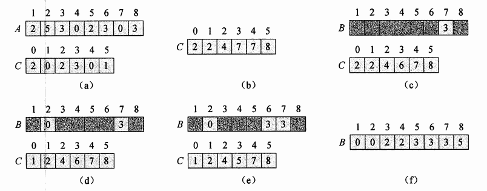

### 计数排序

>计数排序的重要特性是"它是稳定的"：具有相同值的元素，在输出数组中的相对次序，与它们在输入数组中的相对次序相同。

由于上述稳定性，计数排序常用作在 [基数排序](RadixSort.md)算法的子过程中。

基本思想：
1. 对每一个输入元素X，确定小于X的元素个数。
2. 利用1号信息，可以直接把X放到它应该在的位置上。

##### 伪代码

>A为输入数组，B为排序后的输出，C进行暂存。A中元素可能有K个取值

    COUNTING-SORT(A, B , k)
    1. let C[0..K] be a new array
    2. for i = 0 to k
    3.    C[i] = 0
    4. for j = 0 to A.length
    5. C[A[j]] += + 1
    6. //C[i]目前包含：等于i的元素的个数
    7. for i = 1 to k
    8.   C[i] = C[i] + C[i - 1]
    9. //C[i]目前包含：小于等于i的元素的个数
    10. for j = A.length downTo 0{
    11.   B[C[A[j]]] = A[j]
    12.   C[A[j]] -= 1 }

简析：
1. 2~3行，C数组全部被置为0
2. 4~5行，取A中的j号元素A[j]为i，C[i] += 1
3. 7~8行，计算小于/等于C[i]的元素个数，赋值给C[i]
4. 10~12行，从A的最后位元素开始，将该元素放进B中
5. 总复杂度为O(N)