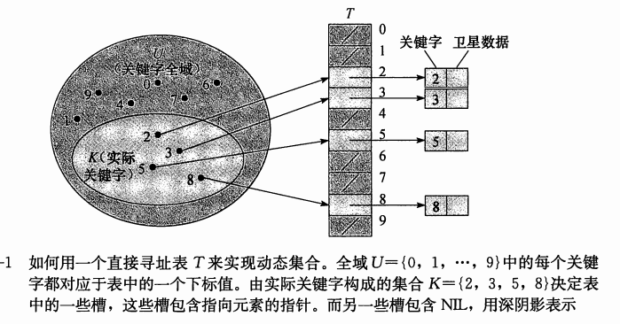
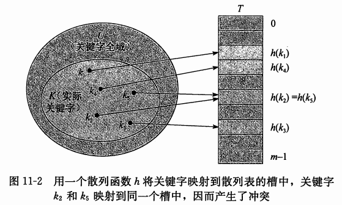

### 哈希表/散列表

##### 发明原因

>假设有一个全域U，需要用到一个动态集合K，此集合所有元素都取自U={0 , 1 ... , m - 1}中的一个关键字。

* 当U比较小时，是用直接寻址表(比如数组)是非常高效的，查找、添加、删除的复杂度为O(1)。
* 但当U变得很大
    * 存储整张U表变得不实际
    * 需要存储的集合K，对于U来说很小，则会浪费大量分配的空间
* 此时使用散列表，可以保证效率的同时，大大减少所需的空间

##### 原理

* 使用数组实现
* 通过散列函数(hash function)，计算关键字k存放的位置h(k)，对数据列表进行哈希化。
* 散列函数h将关键字的全域U映射到散列表的T[0 .. m - 1]槽位上

常见问题：

* 哈希冲突：两个关键字映射到同一个槽位中
>散列函数(hash function)的选择通常要比较巧妙，尽量避免冲突或至少最小化冲突。

##### 冲突解决

* [链接法](conflict/ChainedHash.md)
* [开放寻址法](conflict/OpenAddressingHash.md)