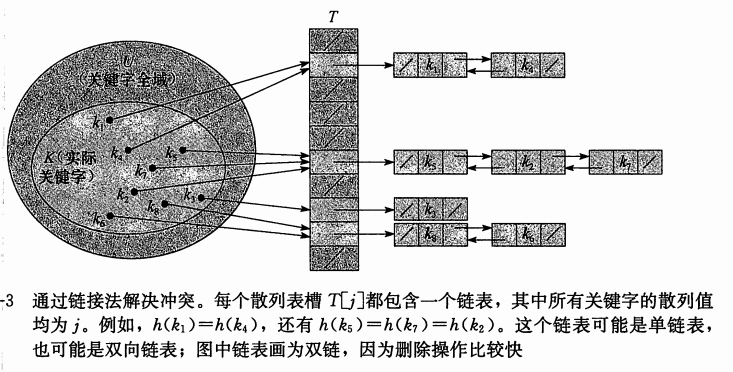

### 链接法解决哈希冲突

>把散列到同一槽中的所有元素，放在一个链表中(Java8的HashMap在链表变大时会再次变化为红黑树)



##### 链接法散列分析

* 装载因子(load factor) α:
    ```
    给定一个能存放n个元素的、有m个槽位的散列表T。
    装载因子α = n / m；即一个链的平均存储元素数。
    α 可以 大于、小于、等于1
    ```
* 简单均匀散列
    ```
    假设：1.任意给定元素会被等可能地散列到m个槽位中的任意一个
        2.散列结果与其他元素被散列的位置无关
    ```
    * 简单均匀散列的一次失败查找(没找到)的时间为O(1 + α)
    * 简单均匀散列的一次成功查找的时间为O(1 + α)
    * 又：如果散列表中槽数至少与表中的元素成正比
        * 则有n = O(m)  ==> α = n/m = O(m)/m = O(1)
    * 即所有字典操作平均情况下都在O(1)时间内完成

##### 优缺点

* 扩容问题
    1. 散列表内以数组存储，在冲突较多时可以考虑扩容
    2. 扩容过程，老数组的每个箱子，经过哈希函数获得新的索引，放到新位置
    3. 除了扩容，也可以将链表转化为红黑树

* 优点：
    1. 处理冲突较简单，没有聚集现象
    2. 链表更适合不确定数量元素
    3. 相比开放寻址法(为了减少冲突，装载因子通常较小)，链接法的装载因子可以超过1，在结点较大时，只是多了指针的引用，更加节省空间
    4. 结点删除只需要删除链表中的指针，操作简单

* 缺点：
    1. 链接法增加了大量指针，在容量较小的情况下，开放寻址法空间更加节省空间
    2. 将节省的指针空间用于对散列表扩容，又可以减小装载因子，开放寻址法的冲突也会变小，查找速度也提高
    3. 总之：在容量不是很大时候，开放寻址法效果更好(类比HashMap和SparseArray)
