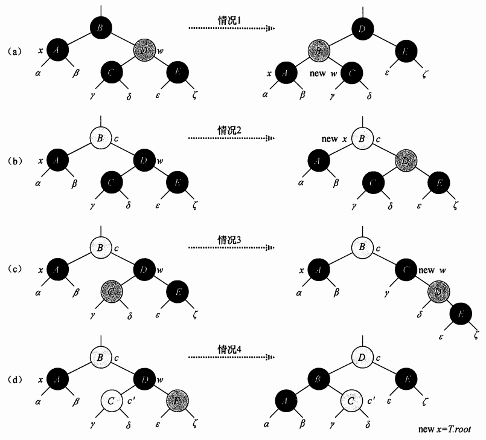

### 红黑树删除结点后的红黑修复

##### 红黑修复简述

[修复过程中的关键定义：]()
* 被删除结点Z
* 标记结点Y(代替Z的位置)、Y的子结点X(代替Y的位置):
    1. Z有两个子结点：则Y为Z的后继结点,X为Y的右子结点(后继结点只有右子结点)
    2. Z的子结点少于2个：则Y指向Z结点，X为另一侧子结点(即使另一侧也是Null)
* X的兄弟结点W(由于X有双重黑色，W肯定不是null，否则W一侧的黑高将小于X一侧)

[修复过程的出口：]()
* 在循环中，X指向一个具有双重黑色的非根结点
* 将X结点的额外黑色，通过循环沿着树进行上移直到符合：
    1. X指向一个红黑结点(此时将X着色为黑色)
    2. X指向根结点(此时直接从双重黑色变成普通黑色，对黑高没有影响)
    3. 进行适当的旋转、重新着色，退出循环

##### 修复详细
* 共4种case
* 变换过程前后，子树根结点(包括根)到每条路径的黑高不变(下方示例图中，α、β、γ之类的路径)
* case1可以转化为case2、case3、case4
* 如果从case1进入case2，此时X为红黑结点，循环结束
* case2使X.p成为新的X来引起循环
* 交换C和D的颜色并捷星右旋，可将case3转化为case4
* case4中：通过重新着色、左旋，将x提升至根结点，去除额外黑色，循环结束

##### Case分析

注：示例给出X为左结点的情况，右结点情况与此完全对应

* Case1：(a)X的兄弟W是红色
    1. 由于W必有黑子结点，此时改变W和X.p的颜色、对X.p进行左旋
    2. 此时X.p.right成为新的W，根据不同情况，进入后续Case
* Case2：(b)X的兄弟W是黑色、W的两个子结点都是黑色
    1. W、W的两个子结点都是黑色，考虑从X、W中都去掉一层黑色，则X为一层黑、W为红
    2. 补偿1中去掉的一层黑，在X.p上增加一层黑，此时X.p是双重颜色结点，成为新的X
    3. 如果直接从Case1进入Case2，由于X.p为红色，新生成的X就是红黑色，此时循环结束
* Case3：(c)X的兄弟W是黑色、W的左子结点是红色、右子结点是黑色
    1. 交换W和W.left的颜色，对W进行右旋
    2. 此时新的W是一个有红色右子结点的黑色结点，进入Case4
* Case4：(d)X的兄弟W是黑色、W的右子结点是红色
    1. 进行一系列着色(W着色为X.p的颜色、X.p着色为Black、W.right着色为Black)
    2. X.p进行一次左旋
    3. 根结点成为新的X，此时循环结束
* 所有Case结束后，将最新的X着色为Black，消除双重颜色。

##### 示例图

注：上图中黑色结点为Black，阴影结点为Red，白色结点为红黑皆可

##### 删除效率
n个节点树高为O(lgN)
* 不进行Fix：时间代价为O(lgN)
* 进行Fix：
    1. Case1/Case3/Case4 会执行常数次数的着色、最多3次的旋转后终止
    2. Case2是循环的唯一情况，X会沿树上升最多O(lgN)次，且没有旋转
    3. 即：Fix花费最多O(lgN)时间、最多3次旋转
* 所以：总时间为O(lgN)

##### 性质修复回顾

理论镇楼

    1. 每个结点不是红的，就是黑的
    2. 根结点总是黑的
    3. 每个叶子结点（NIL）是黑色。 [注意：这里叶子结点，是指为空(NIL或NULL)的叶子结点！]
    4. 如果当前结点是红色，其子结点必须是黑色
    5. 从根结点到任意叶结点的每条路径，包含相同数量的黑结点

可能违反的性质：

    1. 如果Y是根节点，而Y的一个红色子结点成为新的根，违反性质1
    2. X和X.P都是红色，违反性质4
    3. Y移动代替Z，导致原来包含Y的路径，黑高少1，则Y的任何祖先都违反性质5

* 上述讲解中主要进行性质1的恢复
* 性质2修复：
    1. Case2中X沿树上升，最终可能到达根节点
    2. Case4将根节点指向X
    3. 上述两种对根节点进行访问，但最终都将X着色为黑色
    4. 性质2修复成功
* 性质4修复：
    1. 进入循环的条件是X != Root && X.color == Black
    2. X和X.p都是红色情况下，Fix跳过循环，直接将X着色为Black
    3. 此时X.p是红色、X是黑色
    4. 性质4修复成功

