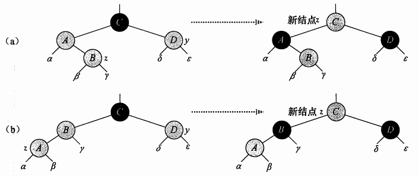
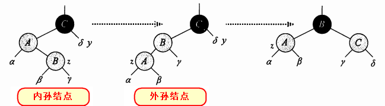
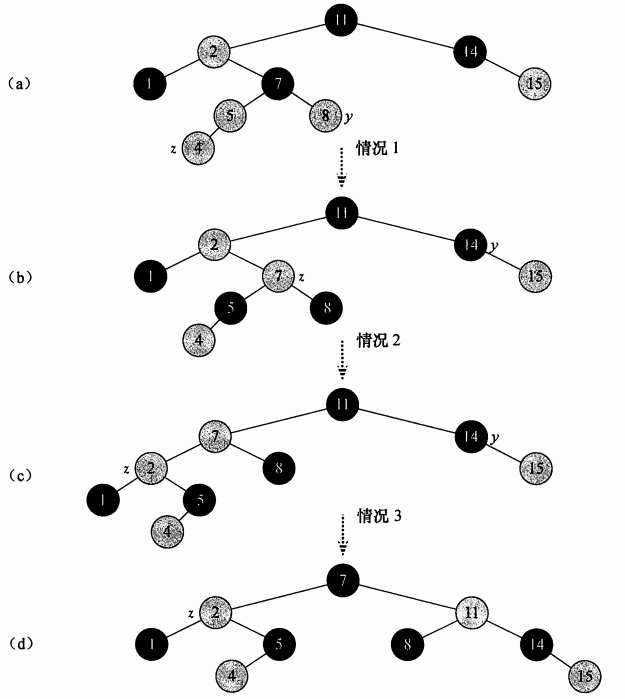

### 红黑树插入结点
理论镇楼

    1. 每个结点不是红的，就是黑的
    2. 根结点总是黑的
    3. 每个叶子节点（NIL）是黑色。 [注意：这里叶子节点，是指为空(NIL或NULL)的叶子节点！]()
    4. 如果当前结点是红色，其子结点必须是黑色
    5. 从根结点到任意叶结点的每条路径，包含相同数量的黑结点

##### 常用理论

1. 寻找插入点过程同于普通的二叉查找树
2. 插入的新结点直接标红，因为红色对黑高影响最少
3. 通过判断插入点Z与父节点(P)、祖父节点(G)、叔结点(Y)的关系，进行重新着色和旋转。
4. 将根结点设置为黑色

父节点(P)两种情况
* 父节点(P)是黑色：一切OK，插入的新红色节点对黑高无影响，且没有连续双红。
* 父节点(P)是红色(此处判断Case并循环，直到P不再是红色):
    1. P是G的左子结点(各种情况如下图所示)，Y是G的右子结点
    ```
    Case1：(a)叔结点Y是红色。将P和Y涂黑，G涂红并成为新的C
    Case2：(内侧孙结点 => 两次旋转)。
    叔结点Y不是红色&&Z是P的右子结点：
    (b)P成为新的Z，Z进行左旋，进入(c)
    (c)目前是Z、P为红，G为黑：P涂黑、G涂红，G进行右旋，树合法。
    Case3:(外侧孙结点 => 一次旋转)。
    叔结点Y不是红色&&Z是P的左子结点：
    (c)目前是Z、P为红，G为黑，P涂黑、G涂红，G进行右旋，树合法。
    ```

    Case1:

    

    Case2&Case3:

    
    ```
    如果是内孙结点，需要先旋转一次，变成外孙结点的状态。
    如果是外孙结点状态，只需要旋转一次。
    ```


    2. P是G的右子结点，Y是G的左子结点(实际上就是把左节点的情况中，左右完全调换就好)

##### 示例图



##### 插入效率
* 一颗n个结点的红黑树，树高为O(lgN)
* 插入、标红新结点，花费O(lgN)时间
* 失衡修复的循环：满足Case1才会重复循环，也就是被执行共O(lgN)次。
* 旋转最多两次：Case2或Case3只要执行，插入就成功了