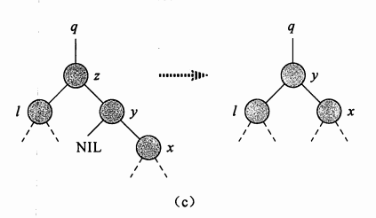
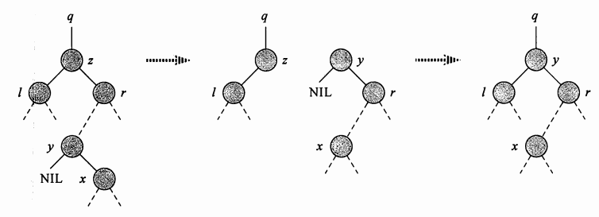

### 二叉树删除结点

##### 二叉搜索树删除结点

>相比其他的树操作，删除稍微复杂一些，主要分为以下几种情况：

* 被删除结点是叶结点(没有子结点)
    ```
    直接删除Z，修改Z的父节点，用null代替Z
    ```
* 被删除结点只有一个子结点
    ```
    将Z的子结点提升到Z原有位置，修改Z的父节点，用Z的子结点替换Z
    ```
* 被删除结点有两个子结点
    ```
    找到Z的后继结点Y(一定要在Z的右子树中)，Y代替Z的位置。
    原来Z的右子树成为Y的新右子树、Z的左子树成为Y的新左子树。
    根据Y是左子节点/右子节点还有两种变化。
    ```

##### 没有子结点
1. 被删除结点为root => rootNode = null
2. 被删除的是parent左结点 => parent.leftChild = null
3. 被删除的是parent右结点 => parent.rightChild = null

[没有子结点](../img/BinaryTreeRemoveNoChild.png)
##### 一个子结点
* 只有左结点
    1. 被删除结点为root => rootNode = currentNode.leftChild
    2. 被删除的是parent左结点 => parent.leftChild = currentNode.leftChild
    3. 被删除的是parent右结点 => parent.rightChild = currentNode.leftChild
* 只有右结点
    1. 被删除结点为root => rootNode = currentNode.rightChild
    2. 被删除的是parent左结点 => parent.leftChild = currentNode.rightChild
    3. 被删除的是parent右结点 => parent.rightChild = currentNode.rightChild

[一个子结点](../img/BinaryTreeRemoveSingleChild.png)
##### 两个子结点
>这个情况是最为复杂的，需要保证二叉树相对平衡，主要操作是寻找[后继结点]()。

"后继结点"是即将出现在被删除结点位置的新结点，有如下特点
* 比被删除的结点大
* 在所有更大的结点中，又是最小的
* 简而言之：被删除结点的右子树中的最左子结点
* 窍门是：在右子树中不停寻找下一个左子结点，什么时候下一个左子结点是null，这个结点就是后继结点

##### 示例图


```
这个比较简单
由于后继节Y点是右节点
Z的左子树可以直接成为Y的左子树
然后用Y代替原有Z的位置即可
```


```
稍微复杂一些
Y是左结点，X是Y的右子树，P是Y的父节点，则P是Z的右子结点
让Y代替原有Z的位置，P成为Y的右子树、Z的左子树成为Y的左子树
X成为P的左子树
```
