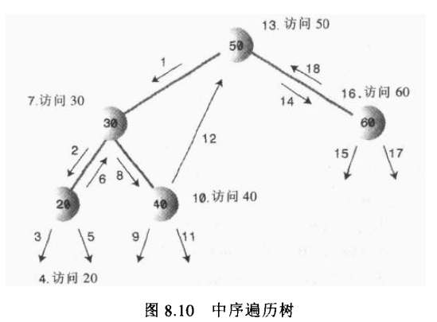

### 二叉树遍历

>遍历是对树的一种最基本的运算，所谓遍历二叉树，就是按一定的规则和顺序走遍二叉树的所有结点，[使每一个结点都被访问一次]()，[而且只被访问一次]()。

>由于二叉树是非线性结构，因此，树的遍历实质上是将二叉树的各个结点转换成为一个线性序列来表示。

##### 遍历顺序

>设L、D、R分别表示遍历左子树、访问根结点和遍历右子树， 则对一棵二叉树的遍历有三种情况：DLR（称为先根次序遍历），LDR（称为中根次序遍历），LRD （称为后根次序遍历）。

* 先序遍历(PerOrder)
>首先访问根，再先序遍历左（右）子树，最后先序遍历右（左）子树，C语言代码如下：

     voidXXBL(tree*root){
     //DoSomethingwithroot
     if(root->lchild!=NULL)
     XXBL(root->lchild);
     if(root->rchild!=NULL)
     XXBL(root->rchild);
     }

* 中序遍历(InOrder)
>首先中序遍历左（右）子树，再访问根，最后中序遍历右（左）子树，C语言代码如下

    voidZXBL(tree*root)
    {
    if(root->lchild!=NULL)
    ZXBL(root->lchild);//DoSomethingwithroot
    if(root->rchild!=NULL)
    ZXBL(root->rchild);
    }

* 后序遍历(PostOrder)
>首先后序遍历左（右）子树，再后序遍历右（左）子树，最后访问根，C语言代码如下

    voidHXBL(tree*root){
    if(root->lchild!=NULL)
    HXBL(root->lchild);
    if(root->rchild!=NULL)
    HXBL(root->rchild);//DoSomethingwithroot
    }

* 层次遍历
>即按照层次访问，通常用队列来做。访问根，访问子女，再访问子女的子女（越往后的层次越低）（两个子女的级别相同）

#### 例题
1. 已知一棵二叉树的前序、中序遍历后的序列，求后序序列。

##### 参考

[二叉树遍历-百度百科](https://baike.baidu.com/item/%E4%BA%8C%E5%8F%89%E6%A0%91#3)