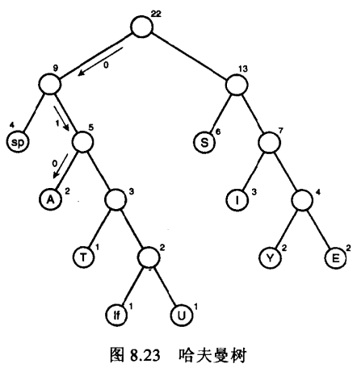
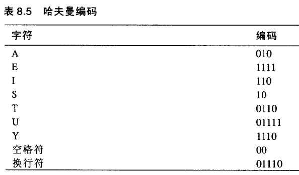

### 哈夫曼树(又称最优二叉树)

>哈夫曼树（Huffman Tree），又称最优二叉树，是一类带权路径长度最短的树。假设有n个权值{w1,w2,...,wn}，如果构造一棵有n个叶子节点的二叉树，而这n个叶子节点的权值是{w1,w2,...,wn}，则所构造出的带权路径长度最小的二叉树就被称为哈夫曼树。

带权路径长度的概念:
>树的带权路径长度指树中所有叶子节点到根节点的路径长度与该叶子节点权值的乘积之和，如果在一棵二叉树中共有n个叶子节点，用Wi表示第i个叶子节点的权值，Li表示第i个也叶子节点到根节点的路径长度，则该二叉树的带权路径长度 WPL=W1*L1 + W2*L2 + ... Wn*Ln。

##### 哈夫曼树特性:
* 对于同一组权值，所能得到的哈夫曼树不一定是唯一的。
* 哈夫曼树的左右子树可以互换，因为这并不影响树的带权路径长度。
* 带权值的节点都是叶子节点，不带权值的节点都是某棵子二叉树的根节点。
* 权值越大的节点越靠近哈夫曼树的根节点，权值越小的节点越远离哈夫曼树的根节点。
* 哈夫曼树中只有叶子节点和度为2的节点，没有度为1的节点。
* 一棵有n个叶子节点的哈夫曼树共有2n-1个节点。

##### 哈夫曼树构建
1. 将给定的n个权值看做n棵只有根节点（无左右孩子）的二叉树，组成一个集合HT，每棵树的权值为该节点的权值。
2. 从集合HT中选出2棵权值最小的二叉树，组成一棵新的二叉树，其权值为这2棵二叉树的权值之和。
3. 将步骤2中选出的2棵二叉树从集合HT中删去，同时将步骤2中新得到的二叉树加入到集合HT中。
4. 重复步骤2和步骤3，直到集合HT中只含一棵树，这棵树便是哈夫曼树。

>对如下消息：[SUSIE SAYS IT IS EASY]()。使用Huffman编码，并构建Huffman树。

[构建一颗Huffman树](../img/HuffmanTreeBuild.png)

>取向左为0，向右为1，获取Huffman编码。

#### 参考
[哈夫曼树与哈夫曼编码（C语言代码实现）](http://blog.csdn.net/u012675150/article/details/43152483)

[【数据结构与算法】Huffman树&&Huffman编码（附完整源码）](http://blog.csdn.net/ns_code/article/details/19174553)