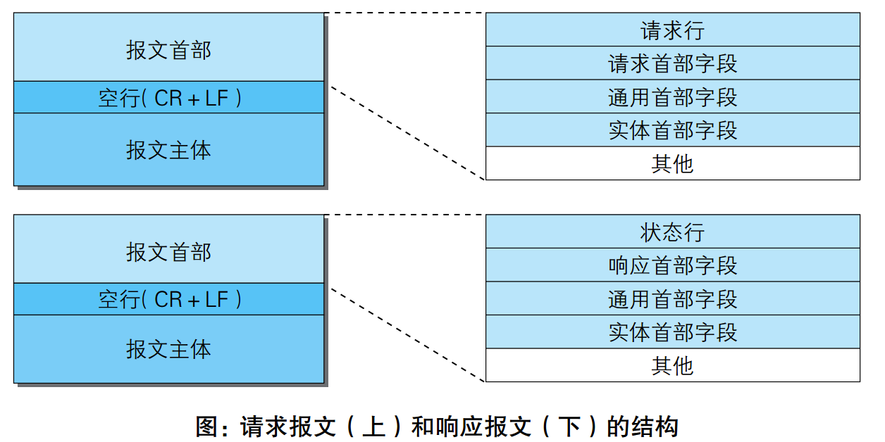

### Http报文结构

整体分为：
1. 报文头
    * 都包括：通用报文头、实体报文头
    1. 请求报文包含：
        1. 请求行：请求方法、URI、Http版本
        2. 请求报文头
    2. 响应报文包含：
        1. 状态行：Http版本、响应码、原因短语
        2. 响应报文头
2. 空行
3. 报文体

Http报文结构：

Http报文实例：

