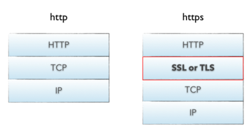

### Https

HTTPS(Secure Hypertext Transfer Protocol)安全超文本传输协议：
1. 是一个安全通信通道，它基于HTTP开发用于在客户计算机和服务器之间交换信息
2. 它使用安全套接字层(SSL)进行信息交换
    1. 简单来说它是HTTP的安全版
    2. 是使用[TLS/SSL](SSL.md)加密的HTTP协议
3. 协议TLS/SSL具有身份验证、信息加密和完整性校验的功能
    1. HTTP协议采用明文传输信息，存在信息窃听、信息篡改和信息劫持的风险
    2. HTTPS避免了HTTP类似的安全问题

#### HTTPS与HTTP主要区别

1. HTTPS标准端口443，HTTP标准端口80;
1. HTTPS基于传输层，HTTP基于应用层;
1. HTTPS是加密传输协议，HTTP是明文传输协议;
1. HTTPS需要用到SSL证书，而HTTP不用;
1. HTTPS比HTTP更加安全，对搜索引擎更友好，利于SEO(Search Engine Optimization)
   1. [为保护用户隐私安全,谷歌优先索引HTTPS网页](http://www.wosign.com/news/2015-1225-01.htm)
   2. [百度开放收录https站点，https全网化势不可挡](http://www.wosign.com/News/baidu-https.html);
1. HTTPS在浏览器显示绿色安全锁，HTTP没有显示;

#### 参考

[HTTPS协议详解(一)：HTTPS基础知识](https://blog.csdn.net/hherima/article/details/52469267)