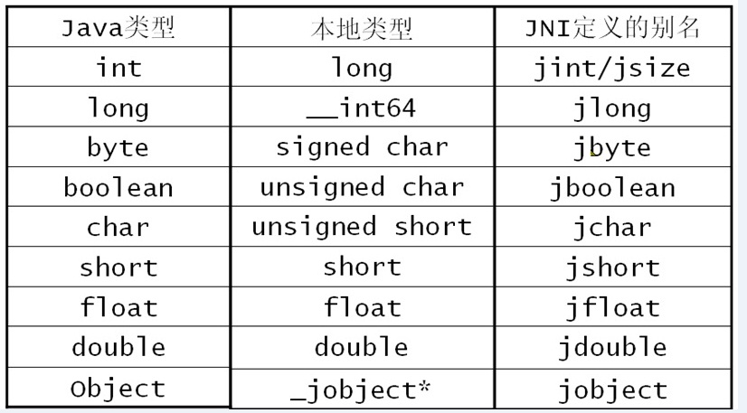

### JNI基础扫盲

##### Java类型与C/C++类型
基础类型、引用类型：



|Java|Jni|描述|
|:-:|:-:|:-:|
|Object|jobject|任何Java对象，或者没有对应java类型到对象|
|Class|jclass|Class对象|
|String|jstring|字符串对象|
|Object[]|jobjectArray|任何对象数组|
|boolean[]|jbooleanArray|布尔型数组|
|byte[]|jbyteArray|比特型数组|
|char[]|jcharArray|字符型数组|
|short[]|jshortArray|短整型数组|
|int[]|jintArray|整型数组|
|long[]|jlongArray|长整型数组|
|float[]|jfloatArray|浮点型数组|
|double[]|jdoubleArray|双浮点型数组|
|void|void|n/a|

##### C/C++中JNI方法签名简介

Java代码如下：
```
public class Test {
　　　　public native void firstTest(String[] testArgs);//
　　　   public static void main(String[] args) {
　　　　　　System.loadLibrary("Jni01");
　　　　　　Test t=new Test();
　　　　　　 t.firstTest(args);
　　　　}
　　}
```

对应的JNI方法：
```
JNIEXPORT void JNICALL Java_com_test01_Test_firstTest   (JNIEnv * env, jobject obj, jobjectArray testArgs);
```
1. JNIEXPORT ：在Jni编程中所有本地语言实现Jni接口的方法前面都有一个"JNIEXPORT",这个可以看做是Jni的一个标志，至今为止没发现它有什么特殊的用处。
2. void ：这个学过编程的人都知道，当然是方法的返回值了。
3. JNICALL ：这个可以理解为Jni 和Call两个部分，和起来的意思就是 Jni调用XXX（后面的XXX就是JAVA的方法名）。
4. Java_com_test01_Test_firstTest：这个就是被上一步中被调用的部分，也就是Java中的native 方法名，这里起名字的方式比较特别，是：包名+类名+方法名。
5. 参数表：前两个参数是固定的。
    1. JNIEnv * env：这个env可以看做是Jni接口本身的一个对象，在上一篇中提到的jni.h头文件中存在着大量被封装好的函数，这些函数也是Jni编程中经常被使用到的，要想调用这些函数就需要使用JNIEnv这个对象。例如：env->GetObjectClass()。（详情请查看jni.h）
    2. jobject obj：
        * 刚才在Test类的main方法中有这样一段代码:　
        * Test t=new Test(); t.firstTest();
        * 这个jobject需要两种情况分析：
            1. 上段代码中firstTest方法是一个非静态方法，在Java中要想调用它必须先实例化对象，然后再用对象调用它，那这个时候jobject就可以看做Java类的一个实例化对象，也就是obj就是t
            2. 如果firstTest是一个静态方法，那么在Java中，它不是属于一个对象的，而是属于一个类的，Java中用Test.firstTest()这样的方式来调用，这个时候jobject就可以看做是java类的本身，也就是obj就是Test.class。
    3. jobjectArray：对应java方法中的参数

##### 参考

[jni中的基本类型、字符串和数组](https://blog.csdn.net/aitumingmumu/article/details/72802949)

[Jni接口-深入研究参数的传递（一）](https://www.cnblogs.com/lsnproj/archive/2012/01/09/2317519.html)