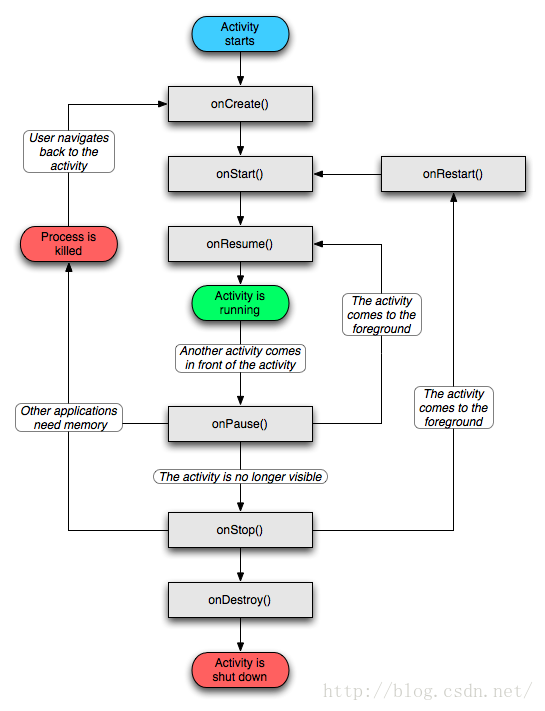

### Activity生命周期

一些说明：
1. 针对一个特定的Activity，第一次启动，回调：onCreate->onStart->onResume
2. 从当前Activity打开另一个Activity或回到桌面，当前Activity回调：onPause->onStop
    * 如果开启的新Activity是透明主题，则原Activity不会回调onStop
3. 再次回到原Activity时，回调：onRestart->onStart->onResume
4. 正常的back键回退：onPause->onStop->onDestroy
5. Activity被系统回收后再次打开，回调与1中一样(但细节过程可能有所不同，见"异常情况声明周期")

关于onStart/onStop和onResume/onPause：
1. 从Activity A开启新的Activity B，B的生命周期与A的生命周期有什么关系？
    * 从结果说：
        1. 先触发A的onPause
        2. 触发B的onCreate->onStart->onResume
        3. 再触发A的onStop
    * 所以：尽量不要在onPause中做耗时操作，类似操作放到onStop中
2. 继续上一条，A启动B之后，对B进行finish：
    * 结果：
        1. onPause(b)
        2. onRestart(a) onStart(a) onResume(a)
        3. onStop(b) onDestroy(b)

##### 异常情况声明周期

1. 资源相关的系统配置发生改变，导致Activity被杀死并重新创建：
    * 如：切换横竖屏、更改语言
    * 系统配置发生后，Activity被销毁，回调onPause、onStop、onDestroy
    * 异常情况下，onStop之前会调用onSaveInstanceState(与onPause没有必然前后关系)，保存当前Activity状态
    * Activity重建之后，回调onRestoreInstanceState，回传onSaveInstanceState中保存的Bundle
        * 此Bundle也会被传给onCreate(可以在onCreate中判断savedInstanceState是否为空)
        * onRestoreInstanceState的调用在onStart之后
        * onRestoreInstanceState与onCreate在此处的区别：
            1. onRestoreInstanceState被调用，则一定有Bundle
            2. onCreate的Bundle在正常启动时是null
            3. 两个方法都可以进行数据恢复，但官方推荐使用onRestoreInstanceState
    * 避免配置变化的重建：
        * 指定"android:configChanges"属性
        * 此时，onSaveInstanceState和onRestoreInstanceState不会被调用
        * 取而代之，onConfigurationChanged被调用
* 在onSaveInstanceState和onRestoreInstanceState中：
    * 系统自动为我们做了一定的恢复工作。
    * Activity异常被杀死，需要重新创建时，系统保存当前的Activity视图结构，在重启后恢复这些数据。
    * 每一个View都有onSaveInstanceState和onRestoreInstanceState，不同的View可以保存、恢复不同的数据
    * 简易流程：
        1. Activity意外终止时，调用onSaveInstanceState保存数据
        2. Activity委托Window，Window委托DecorView，DecorView逐一通知它的子View保存数据
        3. Activity重建时，再按照这种委托，逐一恢复保存的数据。
2. 资源内存不足，导致优先级低的Activity被杀死
    * Activity的优先级，从高到低：
        1. 前台Activity：正在与User交互的Activity
        2. 可见非前台Activity：如Activity弹出Dialog，Activity可见，但无法与User交互
        3. 后台Activity：已被暂停的Activity，如：onStop之后的Activity