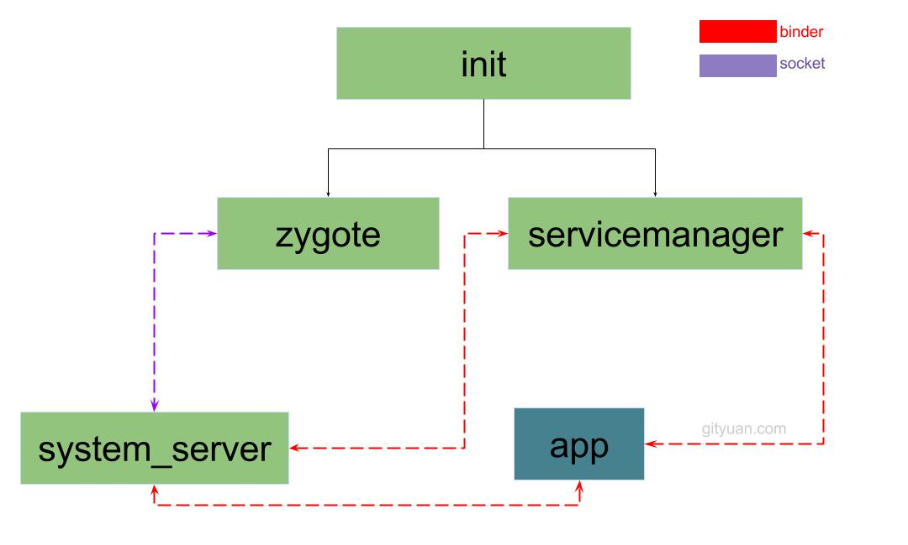

### Android系统启动 综述篇

概述：
* Android系统底层基于Linux Kernel
* Kernel启动过程会创建init进程，该进程是所有用户空间进程的鼻祖
* init进程回启东serviceManager(Binder服务管家)、Zygote进程(Java进程的鼻祖)
* Zygote进程会创建system_server进程，以及各种app进程



##### 1.init进程
```
init是Linux系统中，用户空间的第一个线程(pid=1)
Kernel启动后，会调用/system/core/init/Init.cpp的main()方法
```

1. Init::main的主要功能：
    1. 分析和运行所有的init.rc文件
    2. 生成设备驱动节点(通过rc文件创建)
    3. 处理子进程的终止(signal方式)
    4. 提供属性服务(property service)
2. Zygote的启动
    1. init解析到如下语句，就启动Zygote进程
        ```
        service zygote /system/bin/app_process -Xzygote /system/bin --zygote --start-system-server
            class main //伴随着main class的启动而启动
            socket zygote stream 660 root system //创建socket
            onrestart write /sys/android_power/request_state wake
            onrestart write /sys/power/state on
            onrestart restart media  //当zygote重启时,则会重启media
            onrestart restart netd  // 当zygote重启时,则会重启netd
        ```
    2. 当init的子进程(Zygote)退出时，产生SIGCHLD信号，发送给init进程
        * 通过Socket传递数据，调用到wait_for_one_process方法
        * 根据是否是oneshot，决定：重启子进程 或 放弃启动
        * 缺省模式oneshot=false，因此：Zygote一旦被杀死，就会再次由init进程拉起。

##### 2.Zygote进程
```
当Zygote进程启动后, 便会执行到frameworks/base/cmds/app_process/App_main.cpp文件的main()方法
```
1. App_main::main
    * 解析参数、设置进程名，然后调用AppRuntime::start启动AppRuntime
2. 跳转到AndroidRuntime.cpp，调用AndroidRuntime::start
    1. 创建虚拟机，回调onVmCreated方法
    2. 注册JNI方法
    3. 通过JNI，调用Java方法ZygoteInit::main，此处终于进入Java
3. ZygoteInit::main
    0. 创建ZygoteServer
    1. ZygoteServer::registerServerSocket：为Zygote注册socket
    2. ZygoteInit::preload：预加载类和资源
    3. ZygoteInit::startSystemServer：启动system_server
    4. ZygoteServer::runSelectLoop：进入循环等待socket通信
    5. runSelectLoop会抛出Zygote.MethodAndArgsCaller，main中捕获这个异常，并调用异常的run方法。
4. ZygoteInit::preload
    1. ZygoteInit::preloadClasses：预加载类文件
    2. ZygoteInit::preloadResources：预加载资源文件
    3. ZygoteInit::preloadOpenGL：预加载OpenGL
    4. ZygoteInit::preloadSharedLibraries：预加载三方库
    5. ZygoteInit::preloadTextResources：预加载文字资源
    6. WebViewFactory::prepareWebViewInZygote：准备WebView
5. ZygoteInit::startSystemServer
    1. 拼装参数、并转化为Arguments实例
    2. 以实例为参数，通过Zygote::forkSystemServer方法，fork出子进程"system_server"
    3. ZygoteInit::handleSystemServerProcess：进入system_server进程
6. ZygoteServer::runSelectLoop
    1. 内部阻塞，循环等待Socket客户端发起connect(此请求为了创建新进程)
    2. 一旦accept到客户端的请求，执行ZygoteConnection::runOnce
    3. 接下来会fork出子进程，并最终抛出Zygote.MethodAndArgsCaller异常
    4. 回到ZygoteInit::main方法中

总结：
1. Zygote进程创建虚拟机，并注册JNI方法，成为Java进程的母体，用于孵化Java进程
2. 创建完system_server进程之后，Zygote功成身退，调用runSelectLoop，随时待命
3. 当接收到创建新进程的请求时，唤醒并执行相应工作

##### 3.system_server进程
1. ZygoteInit::handleSystemServerProcess
    1. 设置当前进程名为"system_server"
    2. ZygoteInit::performSystemServerDexOpt：执行dex优化操作(比如services.jar)
    3. 创建PathClassLoader加载器，并设置给当前线程
    4. 调用ZygoteInit::zygoteInit
2. [ZygoteInit::zygoteInit](../../IPC/Process/ProcessCreation/NewProcess.md)
    1. RuntimeInit.redirectLogStreams：重定向log输出
    2. RuntimeInit.commonInit：通用初始化
    3. ZygoteInit.nativeZygoteInit：Zygote初始化
        * 最终进入app_main.cpp的onZygoteInit方法，调用startThreadPool创建Binder线程池
    4. RuntimeInit.applicationInit：应用初始化。最终调用RuntimeInit::invokeStaticMain
        * ZygoteInit::handleSystemServerProcess流程中，类名为"com.android.server.SystemServer"
        * 此处抛出Zygote.MethodAndArgsCaller异常，在ZygoteInit::main方法中捕获
3. 回到ZygoteInit::main处理异常
    * 采用抛出异常的方式,用于栈帧清空,提供利用率
    * 此流程中，MethodAndArgsCaller::run方法会调用至SystemServer::main
4. SystemServer::main => SystemServer::run
    0. 一些前置初始化
    1. Looper::prepareMainLooper
    2. System.loadLibrary("android_servers")：加载在frameworks/base/services下的这个so库
    3. SystemServer::performPendingShutdown：检测上次关机过程是否失败(此方法可能不返回)
    4. SystemServer::createSystemContext：创建系统上下文
        ```
        ActivityThread activityThread = ActivityThread.systemMain();//
        mSystemContext = activityThread.getSystemContext(); //ContextImpl实例
        mSystemContext.setTheme(DEFAULT_SYSTEM_THEME);

        final Context systemUiContext = activityThread.getSystemUiContext();//ContextImpl实例
        systemUiContext.setTheme(DEFAULT_SYSTEM_THEME);
        ```
        * 并调用ActivityThread::systemMain
            * 此处创建通过ContextImpl.createAppContext创建Launcher的Context
            * 通过这个Context的LoadedApk::makeApplication创建Launcher的Application：mInitialApplication
            * 并调用Application::onCreate
    5. 创建系统服务管理
        ```
        mSystemServiceManager = new SystemServiceManager(mSystemContext);
        LocalServices.addService(SystemServiceManager.class, mSystemServiceManager);
        ```
    6. 启动各种系统服务
    7. Looper::loop
5. 启动各种服务
    1. SystemServer::startBootstrapServices
        * Installer、DeviceIdentifiersPolicyService、
        * ActivityManagerService、PowerManagerService、RecoverySystemService
        * LightService、DisplayManagerService等
        * mSystemServiceManager.startBootPhase(SystemService.PHASE_WAIT_FOR_DEFAULT_DISPLAY);
            * 进入Phase100, 创建PKMS, WMS, IMS, DBMS,
            * LockSettingsService, JobSchedulerService, MmsService等服务
    2. SystemServer::startCoreServices
        * DropBoxManagerService、BatteryService、WebViewUpdateService等
    3. SystemServer::startOtherServices
        * 执行一系列Phase
            * phase480 和phase500
                ```
                mSystemServiceManager.startBootPhase(SystemService.PHASE_LOCK_SETTINGS_READY);
                mSystemServiceManager.startBootPhase(SystemService.PHASE_SYSTEM_SERVICES_READY);
                ```
                * 进入Phase480, 调用WMS, PMS, PKMS, DisplayManagerService这4个服务的systemReady();
            * Phase550：进入phase550, 执行AMS.systemReady(), 启动SystemUI, WebViewFactory, Watchdog.
            * Phase600: 进入phase600, 执行AMS.systemReady(), 执行各种服务的systemRunning().
            * Phase1000: 进入1000, 执行finishBooting, 启动启动on-hold进程.
        * 创建各种ServiceManager实例，如WindowManagerService
        * ActivityManagerService::systemReady
6. ActivityManagerService::systemReady(Runnable goingCallback)
    1. 先杀掉所有非persistent进程
    2. 执行goingCallback::run
    3. 启动所有的persistent进程
    4. startHomeActivityLocked：启动homeActivity
    5. mStackSupervisor.resumeFocusedStackTopActivityLocked()：恢复栈顶Activity

##### 4.App进程

* 对于普通App进程，与system_server进程启动过程类似
* 不同是：App进程向system_server进程发消息，由system_server向Zygote发出创建请求
* 见[Android进程创建流程](../../IPC/Process/ProcessCreation.md)
* 最终进入ActivityThread::main

#### 总结

各大核心进程启动后，都进入各种对象对应的主方法：

|进程|主方法|
|:-:|:-:|
|init进程|init::main(C++)|
|Zygote进程|ZygoteInit::main|
|app_process进程|RuntimeInit::main|
|system_server进程|SystemServer::main|
|App进程|ActivityThread::main|

注意：
1. 其中app_process进程是指通过/system/bin/app_process来启动的进程
    * 后面跟的参数不带–zygote，即并非启动zygote进程
    * 比如常见的有通过adb shell方式来执行am,pm等命令，便是这种方式
2. 关于重要进程重启的过程，会触发哪些关联进程重启名单
    1. zygote：触发media、netd以及子进程(包括system_server进程)重启；
    2. system_server: 触发zygote重启;
    3. surfaceflinger：触发zygote重启;
    4. servicemanager: 触发zygote、healthd、media、surfaceflinger、drm重启
    * 所以，surfaceflinger,servicemanager,zygote自身以及system_server进程被杀都会触发Zygote重启。

##### 参考

[Android系统启动-综述 by Gityuan](http://gityuan.com/2016/02/01/android-booting/)