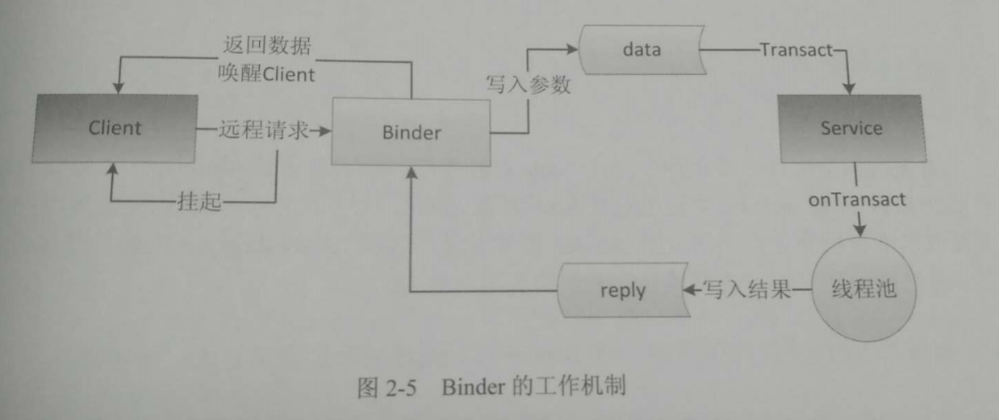

### AIDL

> AIDL:Android Interface Definition Language,即Android接口定义语言

AIDL是Android中IPC的主要手段，ActivityManagerService等等Service，都是AIDL的实现。

##### Sample简析

定义AIDL：
* 如我们需要一个定义如下的IBookManager.aidl
    ```
    interface IBookManager {
        List<Book> getBookList();
        void addBook(in Book book);
    }
    ```
* 则需要创建如sample文件夹中的3个类：
    1. [Book.java](sample/Book.kt)：Parcelable类，IPC中传递的内容
    2. [Book.aidl](sample/Book.aidl)：Book类的parcelable声明
    3. [IBookManager.aidl](sample/IBookManager.aidl)：AIDL中的功能类。
* AIDL的要求：
    * AIDL文件中支持的数据类型：
        1. 基本数据类型、CharSequence/String
        2. 容器(要求容器内的元素都是AIDL支持的类型，包括key、value)：
            * List：只支持ArrayList(服务端可以向客户端传递其他List接口的实现，但客户端收到的时候都是ArrayList)
            * Map：只支持HashMap
        3. Parcelable：所有实现此接口的类型
        4. AIDL：AIDL接口本身也可以在AIDL文件中使用
    * 定向tag(in、out、inout)：表示跨进程通信中，数据的流向。
        ```
        传参时除了Java基本类型以及String，CharSequence之外的类型；
        都需要在前面加上定向tag，具体加什么量需而定；
        ```
        1. in：只能由客户端流向服务端；服务端会接收到客户端的完整数据，但客户端的实例，不会因为服务端对其的求改，而产生变化。
        2. out：只能由服务端流向客户端；服务端只会接收该类型的空实例，但任何修改，都会在客户端同步变化。
        3. inout：可以在客户端、服务端双向流动；服务端接收到客户端的完整数据，客户端也会同步服务端的变化。
* 编译后，会按照模板生成IBookManager在AIDL通信中需要的类：[IBookManager.java](sample/IBookManager.java)
    * 生成的模板类只是为了方便，可以按照AIDL的规范手动书写。
* 客户端&服务端
    * 服务端：Service作为服务，实现配套的AIDL接口，通过Service与AIDL实例的交互，进行通信。
    * 客户端：绑定Service，拿到服务端返回的Binder作为AIDL实例操作。
