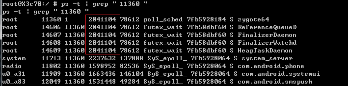

### Zygote创建进程

[Android系统启动-zygote篇](../../../Common/SystemBoot/Boot_Zygote.md)
* 简单来说就是Zygote进程是由由init进程而创建的
* 进程启动之后调用ZygoteInit.main()方法
* 经过创建socket管道，预加载资源后，便进程runSelectLoop()方法

1. 入口方法ZygoteInit::main
    * 创建ZygoteServer，负责处理与客户端的通信。
    * 调用ZygoteServer::runSelectLoop方法进入循环，此方法会抛出MethodAndArgsCaller(既是个Exception，又是个Runnable)
    * 捕获MethodAndArgsCaller异常之后，调用MethodAndArgsCaller::run
2. ZygoteServer::runSelectLoop
    1. 建立与客户端的连接
        * [system_server](SystemServerProcess.md)中，ZygoteProcess::openZygoteSocketIfNeeded
        * Zygote进程收到客户端连接请求之后，通过acceptCommandPeer执行accept。
        * connect与accept配对，连接建立。然后创建ZygoteConnection对象，并添加描述符到fds数组列表中
        * 进入runOnce方法接收客户端数据，并执行进程创建。
    2. ZygoteServer::acceptCommandPeer
        * 建立Socket连接，客户端、服务端通过read、write进行通信。
        * 没有连接请求时进入休眠状态，有创建新进程的连接请求时，唤醒Zygote进程。创建Socket通道，执行runOnce。
3. ZygoteConnection::runOnce
    1. 读取从Socket客户端发送过来的参数列表
    2. 将参数解析为Arguments实例。
    3. 参数传递给Zygote::forkAndSpecialize，得到fork出新进程的pid
    4. 根据pid，进入不同分支
        1. pid == 0：[子进程执行](NewProcess.md)。此分支会抛出Zygote.MethodAndArgsCaller，或执行exec()
        2. else：父进程执行
4. Zygote::forkAndSpecialize，主要执行3个步骤：
    * 
        * 如图所示，Zygote进程有4个Daemon子线程：
            1. ReferenceQueueDaemon：引用队列线程
            2. FinalizerDaemon：析构线程
            3. FinalizerWatchdogDaemon：析构线程
            4. HeapTaskDaemon：Java堆整理线程
        * 图中线程名不完整由于底层进程结构体task_struct是长度16的char数组，超过15字符截断
        * 红圈中是进程的VSIZE(VirtualSize)，代表进程虚拟地址空间大小
            * 与Zygote的VSIZE相同(共享内存空间)的是Zygote的子线程
            * 其余system_server、com.android.phone，是Zygote的子进程
    1. ZygoteHooks::preFork()，3个步骤：
        1. 停止4个Daemon子线程(就是上面图里的4个线程)
        2. 等待所有子线程结束：等待并确保Zygote是单线程(用于提升fork效率)
        3. 完成gc堆的初始化工作：将线程转化为long型并保存到token
    2. Zygote::nativeForkAndSpecialize：
        * 通过JNI调用并跳转到ForkAndSpecializeCommon(C++)
        1. fork子进程
            2. 通过JNI调用Java方法Zygote::callPostForkChildHooks => ZygoteHooks::postForkChild
                1. JNI调用ZygoteHooks_nativePostForkChild(C++)
                    1. 通过token(4.1.3传递过来的)获取当前线程，并设置新进程的主线程id
                    2. 调用DidForkFromZygote
                2. 设置当前系统时间作为新进程的Random随机数种子；进程创建就决定了随机数情况，也就是伪随机数
    3. ZygoteHooks::postForkCommon()
        * 在fork新进程之后，再次启动Zygote的4个Daemon线程
    4. 主要功能小结：
        1. preFork：停止Zygote的4个Daemon子线程，初始化gc堆
        2. nativeForkAndSpecialize：调用fork()创建新进程，设置新进程的主线程id，重置gc性能数据，设置信号处理函数等。
        3. postForkCommon：启动4个Daemon子线程
5. 至此，App进程已完成了创建的所有工作，接下来开始新创建App进程的工作。
    * ZygoteConnection::runOnce中，Zygote完成forkAndSpecialize后
    * 新创建的App进程进入ZygoteConnection::handleChildProc方法
