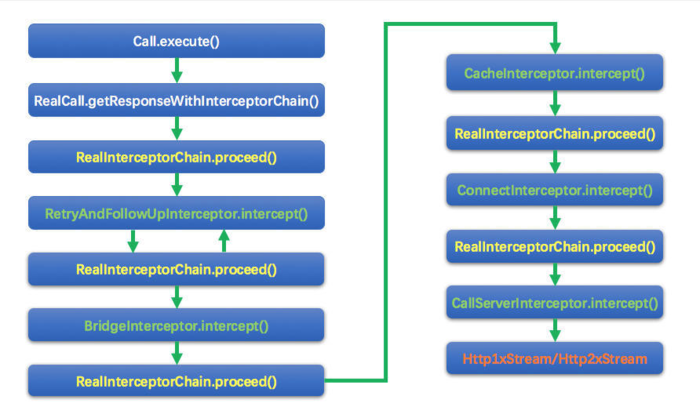

### Interceptor

接口定义：
```
public interface Interceptor {
  Response intercept(Chain chain) throws IOException;

  interface Chain {
    Request request();

    Response proceed(Request request) throws IOException;

    /**
     * Returns the connection the request will be executed on. This is only available in the chains
     * of network interceptors; for application interceptors this is always null.
     */
    @Nullable Connection connection();

    Call call();

    int connectTimeoutMillis();

    Chain withConnectTimeout(int timeout, TimeUnit unit);

    int readTimeoutMillis();

    Chain withReadTimeout(int timeout, TimeUnit unit);

    int writeTimeoutMillis();

    Chain withWriteTimeout(int timeout, TimeUnit unit);
  }
}
```

#### 关键拦截器：

1. [RetryAndFollowUpInterceptor](RetryAndFollowUpInterceptor.md)
1. [BridgeInterceptor]()
    ```
    将Java Api的code，转化为Http请求的code
    比如：
        1. 添加Http的关键header："Content-Type"、"Content-Length"、"Host"、"Connection"、
            "Accept-Encoding"、"User-Agent"等
        2. 添加cookie
            默认没有Cokkie管理功能，需要在构建Client时添加。
    ```
1. [CacheInterceptor](CacheInterceptor.md)
1. [ConnectInterceptor](ConnectInterceptor.md)
1. [CallServerInterceptor](CallServerInterceptor.md)

#### getResponseWithInterceptorChain
Call::execute和Call::enqueue都会通过这个方法进行真实的请求：

1. RealCall::getResponseWithInterceptorChain
    ```
      Response getResponseWithInterceptorChain() throws IOException {
        // Build a full stack of interceptors.
        List<Interceptor> interceptors = new ArrayList<>();
        interceptors.addAll(client.interceptors());//构建Client时通过addInterceptor添加的拦截器
        interceptors.add(retryAndFollowUpInterceptor);//RealCall构造方法中创建的RetryAndFollowUpInterceptor拦截器
        interceptors.add(new BridgeInterceptor(client.cookieJar()));
        interceptors.add(new CacheInterceptor(client.internalCache()));
        interceptors.add(new ConnectInterceptor(client));
        if (!forWebSocket) {
          interceptors.addAll(client.networkInterceptors());//如果不是WebSocket，还会添加Network拦截器
        }
        interceptors.add(new CallServerInterceptor(forWebSocket));

        Interceptor.Chain chain = new RealInterceptorChain(interceptors, null, null, null, 0,
            originalRequest, this, eventListener, client.connectTimeoutMillis(),
            client.readTimeoutMillis(), client.writeTimeoutMillis());

        return chain.proceed(originalRequest);
      }
    ```
    * 按顺序添加Interceptor、创建调用链、处理originalRequest
    1. 最先添加的是普通的Interceptor：通过addInterceptor添加的拦截器
    2. RetryAndFollowUpInterceptor：处理请求失败的重试，重定向
    3. BridgeInterceptor：添加一些请求的头部或其他信息，并对返回的Response做一些友好的处理（有一些信息你可能并不需要）
    4. CacheInterceptor：职责是判断缓存是否存在，读取缓存，更新缓存等等
    5. ConnectInterceptor：职责是建立客户端和服务器的连接
    6. 非WebSocket会有NetworkInterceptor：通过addNetworkInterceptor添加的拦截器
    7. 最后是CallServerInterceptor：最后的拦截器，它负责向Server发送网络请求

#### RealInterceptorChain

[拦截器图解](../img/InterceptorExample.png)

1. 构造方法
    ```
    public RealInterceptorChain(List<Interceptor> interceptors, StreamAllocation streamAllocation,
        HttpCodec httpCodec, RealConnection connection, int index, Request request, Call call,
        EventListener eventListener, int connectTimeout, int readTimeout, int writeTimeout) {
        ...
    }
    ```
    * 整体就是将入参保存到成员变量
    1. index比较重要，通过这个角标,递归实现责任链效果
2. RealInterceptorChain::proceed
    ```
    public Response proceed(Request request, StreamAllocation streamAllocation, HttpCodec httpCodec,
          RealConnection connection) throws IOException {
        if (index >= interceptors.size()) throw new AssertionError();

        calls++;

        // If we already have a stream, confirm that the incoming request will use it.
        if (this.httpCodec != null && !this.connection.supportsUrl(request.url())) {
          throw new IllegalStateException("network interceptor " + interceptors.get(index - 1)
              + " must retain the same host and port");
        }

        // If we already have a stream, confirm that this is the only call to chain.proceed().
        if (this.httpCodec != null && calls > 1) {
          throw new IllegalStateException("network interceptor " + interceptors.get(index - 1)
              + " must call proceed() exactly once");
        }

        // Call the next interceptor in the chain.
        RealInterceptorChain next = new RealInterceptorChain(interceptors, streamAllocation, httpCodec,
            connection, index + 1, request, call, eventListener, connectTimeout, readTimeout,
            writeTimeout);
        Interceptor interceptor = interceptors.get(index);
        Response response = interceptor.intercept(next);

        // Confirm that the next interceptor made its required call to chain.proceed().
        if (httpCodec != null && index + 1 < interceptors.size() && next.calls != 1) {
          throw new IllegalStateException("network interceptor " + interceptor
              + " must call proceed() exactly once");
        }

        // Confirm that the intercepted response isn't null.
        if (response == null) {
          throw new NullPointerException("interceptor " + interceptor + " returned null");
        }

        if (response.body() == null) {
          throw new IllegalStateException(
              "interceptor " + interceptor + " returned a response with no body");
        }

        return response;
      }
    ```
    * 方法很长，但除了中间RealInterceptorChain next这种类似责任链的处理外，都是抛出各种异常
        * 只要某一个Interceptor的表现不符合规定，则抛出对应异常
        * 整体的请求过程也是通过try/catch/finally的处理，进行统一处理
        * calls++保证每个chain只能被proceed一次
    1. 构建一个RealInterceptorChain next，index + 1保证执行后一个Interceptor
    2. 获取当前位置的Interceptor，用它对next进行intercept
    3. 在intercept方法中，next会调用RealInterceptorChain::proceed，会再次进入这个方法
    4. 以此模式将所有Interceptor的拦截功能迭代完毕。
        1. 最后一个Interceptor(实际上是CallServerInterceptor)的intercept完成之后，返回了Response，返回给上一个Interceptor
        2. 然后层层返回，最终回到Call::execute(同步请求)或AsyncCall::execute(异步请求)中
        3. 此时我们终于拿到了新鲜的Response

