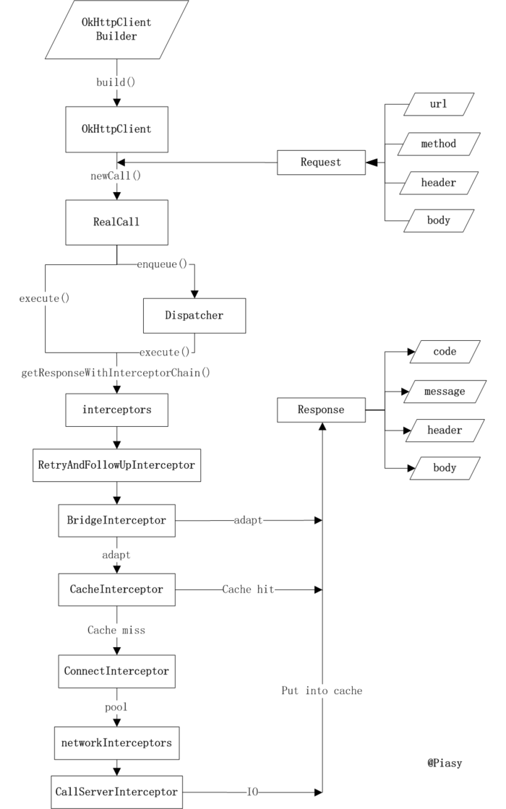

### OkHttp

1. [EasySample](Sample.md)
1. [Request&Response](Detail/Request&Response.md)
1. [Call](Detail/Call.md)
1. [Interceptor](Interceptor/Interceptor.md)

[核心类图(其中Router实际是Route)](img/OkHttpCoreLib.png)

[简单流程图](img/OkHttpProcess.png)

##### 参考
[OKHttp源码解析(一)--初阶](https://www.jianshu.com/p/82f74db14a18)