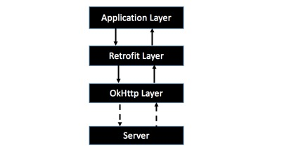

### Retrofit

```
Retrofitting refers to the addition of new technology or features to older systems.
                                                                        —From Wikipedia
```



```
应用程序通过 Retrofit 请求网络，
实际上是使用 Retrofit 接口层封装请求参数、Header、Url 等信息，
之后由 OkHttp 完成后续的请求操作，在服务端返回数据之后，
OkHttp 将原始的结果交给 Retrofit，后者根据用户的需求对结果进行解析的过程。
所谓 Retrofit，其实就是 Retrofitting OkHttp
```

* 原理
    1. 应用["动态代理"](../../../../ProgrammingLanguage/Java/DesignPattern/Structure/ProxyPattern.md)机制，[创建Interface实例](InstanceCreate.md)
    2. 使用注解+Factory模式，[进行请求、响应Mapping](ConverterFactory.md)，[响应类型适配](CallAdapterFactory.md)

##### Compilation

Retrofit2依赖于OkHttp3、okio

```
retrofit2               : "com.squareup.retrofit2:retrofit:${versions.retrofit2}",
retrofit2_converter     : "com.squareup.retrofit2:converter-gson:${versions.retrofit2}",
retrofit2_adapter       : "com.squareup.retrofit2:adapter-rxjava2:${versions.retrofit2}",
```

##### Simple Sample

* Create a Retrofit instance:

```
//此处忽略OkHttpClient的Build细节
OkHttpClient client = new OkHttpClient.Builder().build();

Retrofit.Builder retrofitBuilder = new Retrofit.Builder()
                .client(client)//设置OkHttpClient
                .baseUrl(baseUrl)//设置BaseUrl
                .addConverterFactory(GsonConverterFactory.create())//添加Gson的转换工厂
                .addConverterFactory(StringResponseConverterFactory.create())//添加String的转换工厂
                .addCallAdapterFactory(RxJava2CallAdapterFactory.create());//添加RxJava2的适配器
Retrofit retrofit = retrofitBuilder.build();//创建Retrofit实例
```

* Define a Retrofitted interface

```
interface MyRetrofitService{

    @Post("/xxx/xx/x")
    fun getSthFromGithub(@QueryMap params : Map<String,String>) : Observable<ApiResult<Something>>
}
```

* Perform a Restful call across Retrofit

```
val service : MyRetrofitService = retrofit.create(MyRetrofitService::class.java)//创建Service实例

service.getSthFromGithub(params).subscribe()//发起请求
```

