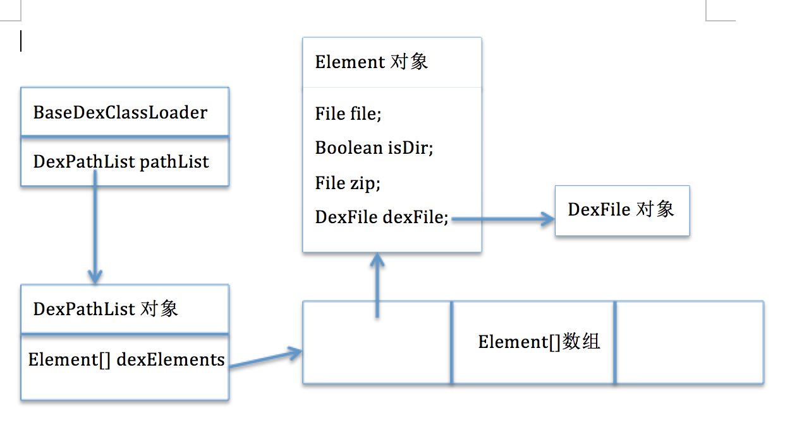

### DexClassLoader

#### 构建DexClassLoader

1. DexClassLoader的构造方法
    ```
    public class DexClassLoader extends BaseDexClassLoader {
        // dexPath：是加载apk/dex/jar的路径
        // optimizedDirectory：是dex的输出路径(因为加载apk/jar的时候会解压除dex文件，这个路径就是保存dex文件的)
        // libraryPath：是加载的时候需要用到的lib库，这个一般不用
        // parent：给DexClassLoader指定父加载器
        public DexClassLoader(String dexPath, String optimizedDirectory,
                String libraryPath, ClassLoader parent) {
            super(dexPath, new File(optimizedDirectory), libraryPath, parent);
        }
    }
    public BaseDexClassLoader(String dexPath, File optimizedDirectory,
            String libraryPath, ClassLoader parent) {
        super(parent);
        this.pathList = new DexPathList(this, dexPath, libraryPath, optimizedDirectory);
    }
    ```
    * 创建DexPathList实例，关联目标路径与Dex
2. DexPathList，解析目标dexPath、输出路径optimizedDirectory，获取所有DexFile
    ```
    private final Element[] dexElements;

    // definingContext对应的就是当前classLoader
    // dexPath对应的就是上面传进来的apk/dex/jar的路径
    // libraryPath就是上面传进来的加载的时候需要用到的lib库的目录，这个一般不用
    // optimizedDirectory就是上面传进来的dex的输出路径
    public DexPathList(ClassLoader definingContext, String dexPath,
            String libraryPath, File optimizedDirectory) {
        ArrayList<IOException> suppressedExceptions = new ArrayList<IOException>();
        this.dexElements = makeDexElements(splitDexPath(dexPath), optimizedDirectory,
                                           suppressedExceptions);
    }

    // files是一个ArrayList<File>列表，它对应的就是apk/dex/jar文件，因为我们可以指定多个文件。
    // optimizedDirectory是前面传入dex的输出路径
    // suppressedExceptions为一个异常列表
    private static Element[] makeDexElements(ArrayList<File> files, File optimizedDirectory, ArrayList<IOException> suppressedExceptions) {
        ArrayList<Element> elements = new ArrayList<Element>();
        /*
         * Open all files and load the (direct or contained) dex files
         * up front.
         */
        for (File file : files) {
            File zip = null;
            DexFile dex = null;
            String name = file.getName();

            // 如果是一个dex文件
            if (name.endsWith(DEX_SUFFIX)) {
                // Raw dex file (not inside a zip/jar).
                try {
                    dex = loadDexFile(file, optimizedDirectory);
                } catch (IOException ex) {
                    System.logE("Unable to load dex file: " + file, ex);
                }
            // 如果是一个apk或者jar或者zip文件
            } else if (name.endsWith(APK_SUFFIX) || name.endsWith(JAR_SUFFIX)
                    || name.endsWith(ZIP_SUFFIX)) {
                zip = file;

                try {
                    dex = loadDexFile(file, optimizedDirectory);
                } catch (IOException suppressed) {
                    /*
                     * IOException might get thrown "legitimately" by the DexFile constructor if the
                     * zip file turns out to be resource-only (that is, no classes.dex file in it).
                     * Let dex == null and hang on to the exception to add to the tea-leaves for
                     * when findClass returns null.
                     */
                    suppressedExceptions.add(suppressed);
                }
            } else if (file.isDirectory()) {
                // We support directories for looking up resources.
                // This is only useful for running libcore tests.
                elements.add(new Element(file, true, null, null));
            } else {
                System.logW("Unknown file type for: " + file);
            }

            if ((zip != null) || (dex != null)) {
                elements.add(new Element(file, false, zip, dex));
            }
        }

        return elements.toArray(new Element[elements.size()]);
    }
    ```
    * 比较关键的Element结构的内容：
        ```
        static class Element {
            private final File file;  // 它对应的就是需要加载的apk/dex/jar文件
            private final boolean isDirectory; // 第一个参数file是否为一个目录，一般为false，因为我们传入的是要加载的文件
            private final File zip;  // 如果加载的是一个apk或者jar或者zip文件，该对象对应的就是该apk或者jar或者zip文件
            private final DexFile dexFile; // 它是得到的dex文件
            ......
        }
        ```
    * 通过loadDexFile方法将目标File包装成DexFile
        ```
        // file为需要加载的apk/dex/jar文件
        // optimizedDirectorydex的输出路径
        private static DexFile loadDexFile(File file, File optimizedDirectory)
                throws IOException {
            if (optimizedDirectory == null) {
                return new DexFile(file);
            } else {
                String optimizedPath = optimizedPathFor(file, optimizedDirectory);
                return DexFile.loadDex(file.getPath(), optimizedPath, 0);
            }
        }
        static public DexFile loadDex(String sourcePathName, String outputPathName,
            int flags) throws IOException {
            return new DexFile(sourcePathName, outputPathName, flags);
        }
        ```
        * optimizedPathFor方法用来得到输出文件dex路径，就是optimizedDirectory/filename.dex
        * optimizedDirectory是前面指定的输出目录，filename就是加载的文件名，后缀为.dex,最终构造得到一个输出dex文件路径.

总结：
1. 在DexClassLoader我们指定了加载的apk/dex/jar文件和dex输出路径optimizedDirectory，它最终会被解析得到DexFile文件
2. 将DexFile文件对象放在Element对象里面，它对应的就是Element对象的dexFile成员变量
3. 将这个Element对象放在一个Element[]数组中，然后将这个数组返回给DexPathList的dexElements成员变量
4. DexPathList是BaseDexClassLoader的一个成员变量



#### DexClassLoader对类的加载

1. 构建DexClassLoader实例，并使用
    ```
    ...
    在try之外声明局部变量
    ...
    is = getAssets().open("app.apk");
    file = new File(getFilesDir(), "plugin.apk");

    fos = new FileOutputStream(file);
    byte[] buffer = new byte[1024];
    int len;
    while ((len = is.read(buffer)) != -1) {
        fos.write(buffer, 0, len);
    }
    fos.flush();
    String apkPath = file.getAbsolutePath();
    dexClassLoader = new DexClassLoader(apkPath, getFilesDir().getAbsolutePath(), null, getClassLoader());
    ```
    * 使用DexClassLoader加载目标类：
        ```
        clazz = dexClassLoader.loadClass("com.example.apkplugin.PluginTest");
        ```
2. DexClassLoader::loadClass
    1. 由于DexClassLoader及其父类BaseDexClassLoader都没有重写loadClass方法，实际调用ClassLoader::loadClass
        ```
        public Class<?> loadClass(String className) throws ClassNotFoundException {
            return loadClass(className, false);
        }

        protected Class<?> loadClass(String name, boolean resolve) throws ClassNotFoundException {
            // First, check if the class has already been loaded
            Class<?> c = findLoadedClass(name);
            if (c == null) {
                try {
                    if (parent != null) {
                        c = parent.loadClass(name, false);
                    } else {
                        c = findBootstrapClassOrNull(name);
                    }
                } catch (ClassNotFoundException e) {
                    // ClassNotFoundException thrown if class not found
                    // from the non-null parent class loader
                }
                if (c == null) {
                    // If still not found, then invoke findClass in order
                    // to find the class.
                    c = findClass(name);
                }
            }
            return c;
        }
        ```
        * 由于要加载的类在其他的apk、jar、zip、dex文件中，所以通过双亲委托模型的父加载器无法成功加载到目标类
        * 最终调用findClass方法，DexClassLoader并没有重写，直接调用BaseDexClassLoader::findClass
3. BaseDexClassLoader::findClass
    ```
    @Override
    protected Class<?> findClass(String name) throws ClassNotFoundException {
        List<Throwable> suppressedExceptions = new ArrayList<Throwable>();
        Class c = pathList.findClass(name, suppressedExceptions);
        if (c == null) {
            ClassNotFoundException cnfe = new ClassNotFoundException("Didn't find class \"" + name + "\" on path: " + pathList);
            for (Throwable t : suppressedExceptions) {
                cnfe.addSuppressed(t);
            }
            throw cnfe;
        }
        return c;
    }
    ```
    * 可知是通过DexPathList::findClass，从pathList中进行寻找
4. DexPathList::findClass
    ```
    public Class findClass(String name, List<Throwable> suppressed) {
        for (Element element : dexElements) {
            DexFile dex = element.dexFile;

            if (dex != null) {
                Class clazz = dex.loadClassBinaryName(name, definingContext, suppressed);
                if (clazz != null) {
                    return clazz;
                }
            }
        }
        if (dexElementsSuppressedExceptions != null) {
            suppressed.addAll(Arrays.asList(dexElementsSuppressedExceptions));
        }
        return null;
    }
    ```
    * 通过DexFile::loadClassBinaryName获取Class实例
    * 此方法内部调用defineClass(String name, ClassLoader loader, int cookie)，是一个native方法