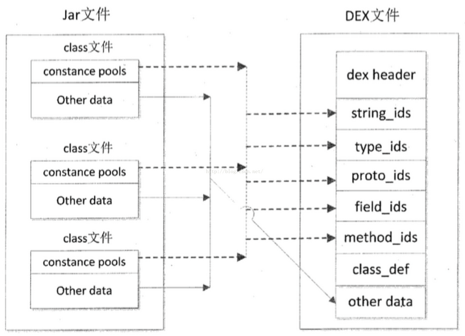

### JVM-Dalvik-ART

##### JVM简介
* Java虚拟机，本质上是一个软件,是计算机硬件的一层软件抽象。Java程序可以在这个虚拟机上运行。
* Java在编译后，会生成类似汇编语言的JVM字节码。
    * C/C++编译产生的汇编语言可以直接在硬件上运行
    * Java编译后生成的字节码需要在JVM上运行。
    * 通过JVM，将字节码翻译成机器指令，Java程序才真正的运行起来。
* JVM运行在操作系统上，屏蔽了底层实现的差异，达到"Write Once Run Anywhere"的效果。
* 有几十种的虚拟机根据JVM规范实现，主流的包括Hotspot、Jikes RVM等，都是用C/C++和汇编编写的。

##### Dalvik虚拟机

```
Dalvik VM，是Android系统中使用的虚拟机。
所有安卓程序都运行在安卓系统进程中，每个进程对应一个Dalvik虚拟机实例。
```

与JVM的主要区别：
1. 字节码种类不同
    1. Java虚拟机运行Java字节码
        * Java程序经过编译，生成Java字节码，保存在.class文件中
        * JVM通过解码class文件中的内容，来运行程序
    2. Dalvik虚拟机运行Dalvik字节码
        * Dalvik字节码都是由Java字节码转化而来，并被打包到一个Dex(Dalvik Executable)可执行文件中
        * DVM通过解释Dex文件来执行Dalvik字节码
2. Dalvik的可执行文件更小
    1. [Java的class文件结构，见JVM](../../../../ProgrammingLanguage/Java/JVM/ClassFileStructure/CFS_Intro.md)
        * 多个不同的类会同时包含相同的方法签名
        * 同样，大量字符串常量在多个类文件中被重复使用
        * 诸多冗余信息，直接增加了文件的体积；JVM解析class文件效率也随之被拖慢。
    2. SDK中的dx工具对Java类文件进行重新排列
        * 所有Java类文件的常量池会被分解，消除冗余信息，重新组成一个新的常量池
        * 所有的类文件，共享同一个常量池；相同的字符串、常量在dex文件中只出现一次，减小文件体积。

        
3. 虚拟机结构不同
    1. Java虚拟机基于栈结构
        * 程序运行时，VM需要频繁地从栈上读取/写入数据
        * 整个过程需要更多的指令分派和内存访问，耗费更多CPU时间
    2. Dalvik虚拟机基于寄存器架构
        * 数据访问通过寄存器直接传递
        * 通常，寄存器的访问比栈访问要快(当然，Dalvik虚拟机的寄存器也只是虚拟机的寄存器，并不是CPU的寄存器)
    3. 示例：
        ```
        public int foo(int a, int b) {
                return (a + b) * (a - b);
            }
        上述方法，在JVM中时这样的：
            0: iload_1
            1: iload_2
            2: iadd
            3: iload_1
            4: iload_2
            5: isub
            6: imul
            7: ireturn

        在Dalvik中是这样的：
            0000: add-int  v0, v3, v4
            0002: sub-int  v1, v3, v4
            0004: mul-int/2addr  v0, v1
            0005: return  v0
        ```

##### ART虚拟机

先了解JIT(Just In Time)和AOT(Ahead Of Time)两种编译模式：
1. JIT，以JVM为例：
    * 没有JIT的时候：
        * javac把程序源码编译成JAVA字节码
        * JVM通过逐条解释字节码将其翻译成对应的机器指令
        * 逐条读入，逐条解释翻译，执行速度必然比C/C++编译后的可执行二进制字节码程序慢
    * 为了提高执行速度，引入了JIT：
        * JIT会在运行时分析应用程序的代码
        * 识别哪些方法可以归为"热方法"
            * 它们会被JIT编译器编译成对应的汇编代码
            * 然后存储到代码缓冲区
        * 之后调用这些方法就不用解释执行，直接使用缓存好的汇编代码
    * 安卓Dalvik虚拟机在2.2中加入了JIT
2. AOT，指的主要是C/C++这种语言：
    * 编译器在编译期时，直接将程序源码编译成目标机器码
    * 运行时，直接运行机器码

Dalvik和ART的区别：
1. Dalvik虚拟机执行的是dex字节码
    * Dalvik执行dex字节码，依靠JIT编译器进行解释执行。
    * JIT的编译发生在运行期，每次重启应用程序，JIT都要重新进行编译
2. ART虚拟机执行的是本地机器码
    * 安装过程中，dex字节码被编译成本地机器码
    * 应用即使重启，也不需要再次编译
    * 安卓4.4发布了ART，5.0中废弃了Dalvik

ART的优缺点：
1. 优点：
    1. 系统性能提升显著
    2. 应用启动更快、运行更快、体验更流畅、触摸反馈更及时
    3. 续航能力提升
    4. 支持更低端的硬件
2. 缺点：
    1. 更大的存储空间(保守估计也要10%~20%)
    2. 更长的应用安装时间

```
总体而言，ART对于Dalvik属于一种"空间换时间"。
```

##### 参考

[JAVA虚拟机、Dalvik虚拟机和ART虚拟机简要对比](https://blog.csdn.net/jason0539/article/details/50440669)

[JVM、DVM(Dalvik VM)和ART虚拟机对比](https://blog.csdn.net/evan_man/article/details/52414390)

[Dalvik虚拟机垃圾收集机制简要介绍和学习计划 by 老罗](https://blog.csdn.net/luoshengyang/article/details/41338251)

[Android运行时ART简要介绍和学习计划 by 老罗](https://blog.csdn.net/luoshengyang/article/details/39256813)