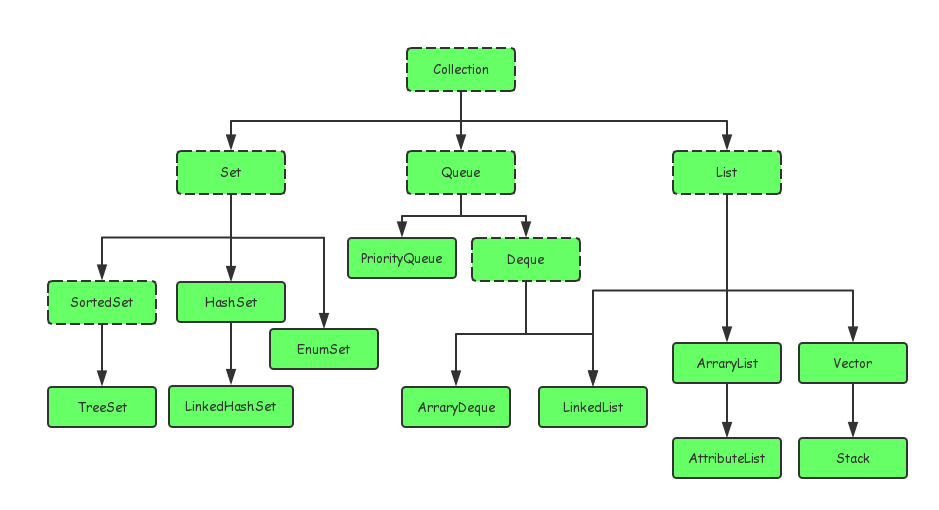
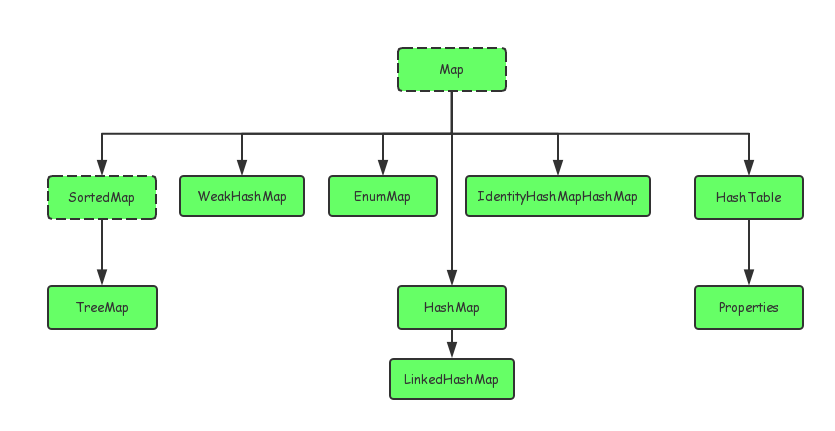

### Java集合框架

1. Collection
    1. List
    2. Set
    3. Queue
2. Map
    1. [HashMap](HashMap/HashMap.md)
    2. [LinkedHashMap](Map/LinkedHashMap.md)
    3. [ConcurrentHashMap](Map/ConcurrentHashMap.md)

Collection图谱:

Map图谱：

