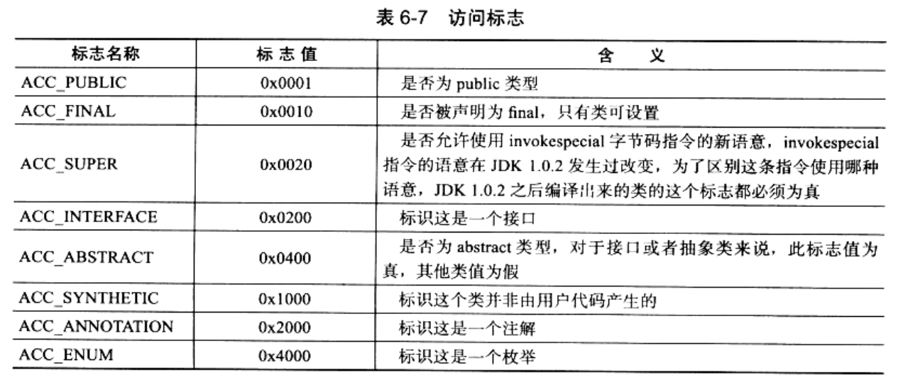

### 访问标志

> 常量池结束之后，紧接着的2个字节，代表访问标志(access_flags)

* 这个标志用于识别一下类或者接口层次的访问信息，包括：
    1. 这个Class是类还是接口
    2. 是否定义为public类型
    3. 是否定义为abstract类型
    4. 如果是类的话，是否被声明为final等

* 上述flag进行<位或运算>，形成一个完整的描述。
* access_flags中一共有16个标志位可以使用，当前只定义了其中8个(JVM规范中只定义了开头5种，JDK1.5中增加了后面3中)