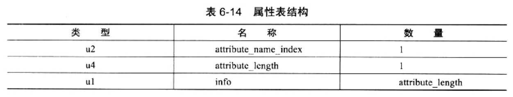
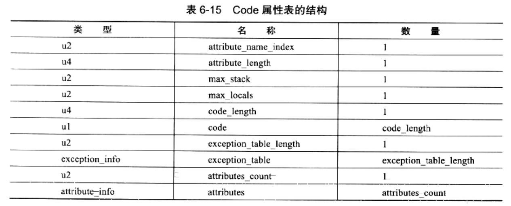
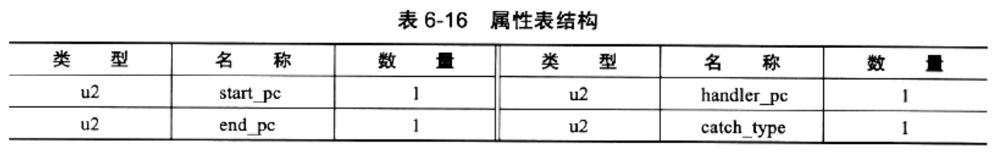

### 属性表集合

> Class文件、字段表、方法表都可以携带自己的属性表集合，用于描述某些场景专有的信息。

此部分比较冗长，参见[《深入理解Java虚拟机》6.3.7节]()

规范：
1. 属性表集合的限制相对其他项目的要求(严格顺序、长度、内容不同)，稍微宽松了一些
2. 不再要求各个属性表具有严格顺序
3. 只要不与已有属性名重复，任何人实现的编译器都可以向属性表中写入自己定义的属性信息
4. Java虚拟机运行时会忽略掉它不认识的属性

截止Java SE 7的JVM规范中，预定义属性已增加到21项：

[part1](img/PresetAttribute_1.png)

[part2](img/PresetAttribute_2.png)

[part3](img/PresetAttribute_1.png)

##### 属性表结构

对于每个属性：
1. 它的名称需要从常量池中引用一个CONSTANT_Utf8_info类型的常量来表示
2. 而属性值的结构则是完全自定义的
3. 只需要通过一个u4的长度属性去说明属性值所占用的位数即可
4. 合规属性表应满足如下结构：

    

##### Code属性

Code属性是Class文件中，最重要的一个属性：
* 如果把一个Java程序中的信息分为两部分：
    1. 代码(Code，方法提里的Java代码)
    2. 元数据(MetaData，包括：类、字段、方法定义以及其他信息)
* 那么在整个Class文件中，Code属性用于描述代码，所有的其他数据项目，都用于描述元数据

Code简析：
* Java程序方法体中的代码，经过Javac编译器处理后，最终变成字节码指令，存储在Code属性内。
* Code属性出现在方法表的属性集合中
* 但并非所有的方法表都必须存在这个属性，譬如：
    1. 接口或者抽象类中的方法，就不存在Code属性(JDK8中，出现了接口的default/static方法)
    2. 如果方法表有Code属性存在，那它的结构将如下表：

        

Code表结构简析：
1. attribute_name_index：代表该属性的属性名称，是一项指向CONSTANT_Utf8_info型常量的索引，常量值固定为"Code"
2. attribute_length：属性值的长度(由于属性名称索引与属性长度一共6个字节，所以属性值的长度固定为：整个属性表长度-6个字节)
3. max_stack：操作数栈(Operand Stacks)深度的最大值
    * 方法执行的任意时刻，操作数栈都不会超过这个深度
    * VM运行的时候，根据这个值来分配栈帧(Stack Frame)中的操作栈深度
4. [max_locals：局部变量表所需的存储空间。]()
    * 在这里，max_locals的单位是：Slot
    * Slot是VM为局部变量分配内存所使用的最小单位：
        1. byte、char、float、int、short、boolean和returnAddress等长度不超过32的数据类型，每个局部变量占用1个Slot
        2. double和long这两种64位的数据类型需要2个Slot来存放
    * 以下都需要局部变量表存放：
        1. 方法参数(包括实例方法中的隐藏参数"this")
            1. 实力方法的局部变量表中，至少会存在一个指向当前对象实例的局部变量
            2. 局部变量表中也会预留出第一个Slot位来存放对象实例的引用
            3. 方法参数值从1开始计算，这个处理支队实例方法有效
            4. 如果是static方法，就不会有这个this
        2. 显示异常处理器的参数(Exception Handler Parameter，就是try-catch语句中，catch块所定义的异常)
        3. 方法提中定义的局部变量
    * 另外：
        1. 并不是在方法中用到了多少个局部变量，就把这些局部变量所占Slot的和作为max_locals的值
        2. 因为：局部变量中的Slot可以重用
        3. 当代码执行超出一个局部变量的作用域时，这个局部变量所占的Slot可以被其他局部变量所使用
    * Javac编译器会根据变量的作用域来分配Slot给各个变量使用，然后计算出max_locals的大小
5. code_length：字节码长度
    * 虽然它是一个u4类型的长度值，理论上最大值可达到2^32 - 1
    * 但虚拟机规范中明确限制了：一个方法不允许超过65535条字节码指令
    * 实际上，它只使用了u2的长度
    * 如果超过这个限制，Javac编译器也会拒绝编译
6. code：存储字节码指令的一系列字节流。
    * 每一个指令时一个u1类型的单字节
    * VM读取到code中的一个字节码时：
        1. 可以对应找出这个字节码代表的是什么指令
        2. 并且可以知道这条指令后面是否需要跟随参数
        3. 以及参数应当如何理解
    * u1数据类型的取值范围为：0x00~0xFF，对应十进制的0~255，也就是共可以表示256条指令
    * 目前JVM规范已经定义了其中约200条编码值对应的指令含义。见[虚拟机字节码指令表]()
7. exception_table_length：异常表长度
8. exception_table：显示异常处理表集合
    * 对Code属性来说，并不是必须存在的
    * 异常表结构如下：

    
    * 异常表字段含义：
        1. 如果字节码在start_pc行到end_pc行之间(不含end_pc)<实际上不是"行"，而是相对于方法体开始的偏移量>
        2. 出现了类型为catch_type或者其子类的异常(catch_type为指向一个COSNTANT_Class_info型常量的索引)
        3. 则转到第handler_pc行继续处理
        4. 当catch_type的值为0时，代表任意异常情况都需要转到handler_pc进行处理
    * 异常表，实际上是Java代码的一部分，编译器使用异常表，而不是简单的跳转命令来实现Java异常及finally处理机制

##### 不那么重要/复杂的属性

1. Exceptions属性：
    * 此处的Exceptions属性，在方法表中与Code是平级的属性
    * 不要与Code中的异常表产生混淆
    * 此属性作用：列举出方法中，可能抛出的受查异常(Checked Exceptions)
    * 也就是方法描述时在throws关键字后面列举的异常
2. LineNumberTable属性：
    * 用于：描述Java源码行号，与字节码行号(字节码的偏移量)之间的对应关系
    * 并不是运行时必须的属性，会默认生成到Class文件中(Javac中使用-g:none、-g:lines进行开关)
    * 如果不生成此属性，最大的影响是：
        1. 抛出异常时，堆栈中将不会显示出出错的行号
        2. 调试程序时：无法按照源码行来设置断点
3. LocalVariableTable属性：
    * 用于：描述栈帧中，局部变量表中的变量，与Java源码中定义的变量之间的关系
    * 并不是运行时必须的属性，会默认生成到Class文件中(Javac中使用-g:none、-g:vars进行开关)
    * 如果不生成此属性，最大的影响是：
        1. 其他人引用这个方法是，所有的参数名都将丢失(会变成arg0/arg1之类占位符)
        2. 调试期间，无法根据参数名从上下文中获得参数值
    * JDK1.5引入泛型后，此属性增加了一个"姊妹属性"：LocalVariableTypeTable
        1. 出现原因：描述符中，泛型的参数化类型会被擦除，描述符无法准确地描述泛型类型
4. SourceFile属性：
    * 用于：记录生成这个Class文件的源码文件名称
    * 并不是运行时必须的属性(Javac中使用-g:none、-g:source进行开关)
    * Java中，对于大多数的类来说，类名和文件名是一致的，但有些特殊情况(如：内部类)
    * 如果不设置：抛出异常时，堆栈中将不会显示出错代码所属的文件名
5. InnerClasses属性:
    * InnerClasses属性用于记录内部类与宿主类之间的关联
    * 如果一个类中定义了内部类，那编译器将会为它以及它所包含的内部类，生成InnerClasses属性
6. Deprecated、Synthetic属性：
    * 这两个属性都术语标志类型的布尔属性
    * 只存在有和没有的区别，没有属性值的概念
    * Deprecated：
        1. 用于：表示某各类、字段、方法，已经被程序作者定位不再推荐使用
        2. 可以通过在代码中使用@deprecated注释进行设置
    * Synthetic：
        1. 代表：此字段或方法，并不是由Java源码直接产生的，而是由编译器自行添加的
        2. JDK1.5之后，标识一个类、字段或者方法是编译器自动产生的，也可以设置他们的访问标志中的ACC_SYNTHETIC标志位
            * 其中，最典型的例子就是：Bridge Method
        4. 所有由非用户代码产生的类、方法及字段，都应该至少设置Synthetic属性和ACC_SYNTHETIC标志位中的一项
            * 唯一的例外是：实例构造器<_init>和类构造器<_clinit>

##### ConstantValue属性

> ConstantValue属性的作用是：通知虚拟机自动为静态变量赋值。

只有被static关键字修饰的变量(类变量)才可以使用这项属性：
* 类似："int x = 123" 和 "static int x = 123"这种变量定义，Java程序中是很常见的
* 但VM对这两种变量赋值的方式和时刻，都有所不同：
    * 对于非static类型的变量(实例变量)，赋值操作是在实例构造器<_init>方法中进行的
    * 对于类变量还有两种可能：
        1. 在类构造器<_clinit>方法
        2. 使用ConstantValue属性
        3. 目前Sun Javac编译器的选择时：
            1. 如果同时使用final和static来修饰一个变量(称之为"常量"更贴切)
            2. 并且这个变量的数据类型是：基本类型或java.lang.String类型的话
            3. 就生成ConstantValue属性来进行初始化
            4. 不符合1、2两条的，选择在<_clinit>方法中进行初始化

注：
* 关于final：
    * 虽然有final关键字，才能更符合"ConstantValue"的语义
    * 但VM规范中，并没有强制要求字段必须设置ACC_FINAL标志
    * 值要求了：有ConstantValue属性的字段必须设置ACC_STATIC标志而已
    * 对于final关键字的要求，是Javac编译器自己加入的限制
* 关于基本类型和String
    * 至少参考书的笔者并不认为这是什么现实
    * 因为：此属性的属性值只是一个常量池的索引号
    * 由于Class文件格式的常量类型中只有：基本属性和字符串想对应的字面量
    * 所以，就算ConstantValue属性想支持别的类型，也是无能为力的。

