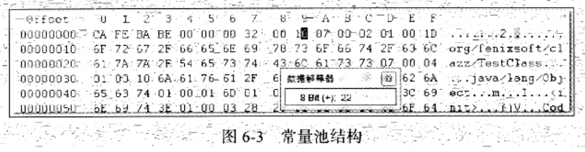
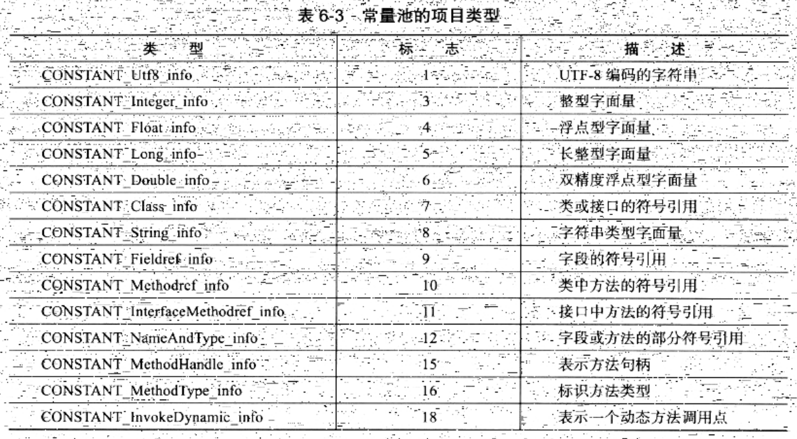

### 常量池

> 紧接着主次版本号之后的是常量池入口

* 常量池可以理解为Class文件之中的资源仓库
* 它是Class文件结构中与其他项目关联最多的数据类型，也是占用Class文件空间最大的数据项目之一
* 同时，他还是在Class文件中第一个出现的表类型数据项目


##### 常量池计数值

* 由于常量池中常量的数量是不固定的
* 所以在常量池的入口需要放置一项u2类型的数据，代表常量池容量计数值(constant_pool_count)
* 与Java中语言习惯不一样的是：这个容量计数是从1而不是0开始的
* Class文件格式规范制定之时，设计者将第0想常量空出来，是有特殊考虑的：
    1. 目的在于：满足后面某些指向常量池的索引值的数据在特定情况下需要表达<不引用任何一个常量池项目>的含义
    2. 这种情况就可以把索引值置为0来表示
* Class文件结构中只有常量池的容量计数是从1开始
    ```
    对于其他集合类型：接口索引集合、字段表集合、方法表集合等的容量计数
    都与一般习惯相同，是从0开始的
    ```

如下示例：



* 常量池容量(偏移地址：0x00000008)为十六进制数0x0016，即十进制的22
* 这代表常量池有21项常量(从1开始计数)，索引值范围为1~21

##### 常量池数据简述

* 常量池主要存放两大类常量：字面量(Literal)和符号引用(Symbolic References)
    * 字面量比较接近于Java语言层面的常量概念，如：文本字符串、声明为final的常量值等
    * 符号引用则属于编译原理方面的概念，包括了下面3类常量
        1. 类和接口的全限定名(Fully Qualified Name)
        2. 字段的名称和描述符(Descriptor)
        3. 方法的名称和描述符
* 常量池中每一项常量都是一个表
    * 在JDK1.7之前，共有11中结构各不相同的表结构
    * JDK1.7中，为了更好地支持动态语言调用，又额外增加了3种:
        1. CONSTANT_MethodHandle_info
        2. CONSTANT_MethodType_info
        3. CONSTANT_InvokeDynamic_info

##### 常量池与类加载

* Java代码在进行Javac编译 时，并不像C和C++有"连接"这一步骤。而是在虚拟机加载Class文件的时候，进行动态链接。
* 也就是说：Class文件中不会保存各个方法、字段的最终内存布局信息
* 因此这些字段、方法的符号引用不经过运行期转换的话，无法得到真正的内存入口地址，也就无法直接被虚拟机使用
* 当虚拟机运行时，需要从常量池获得对应的符号引用，再在类创建时或运行时解析、翻译到具体的内存地址中

[详见：虚拟机类加载过程](../ClassLoading/ClassLoadingProcess.md)


##### 常量类型



* 这14种表都有一个共同的特点：
    * 表开始的第一位是一个u1类型的标志位(tag，取值为上表标志列)
    * 代表当前这个常量属于哪种常量类型
* 之所以说常量池是最烦琐的数据：因为这14中常量类型，各自均有自己的结构

##### 名称的65535

* 由于Class文件中，方法、字段等，都需要引用CONSTANT_Utf8_info型常量来描述名称
* 所以，CONSTANT_Utf8_info型常量的最大长度，也就是Java中方法、字段名的最大长度
* 这里的最大长度就是length的最大值，即u2类型能表达的最大值65535.
* 所以，Java程序中，如果定义超过了64K应为字符的变量名或方法名，将无法编译

##### 常量池中14中常见项的结构 总表

[part1](img/ConstantPool_ConstantType_Full_1.png)

[part2](img/ConstantPool_ConstantType_Full_2.png)

[part3](img/ConstantPool_ConstantType_Full_3.png)

##### 常量池详细

常量池数据非常繁琐，在此不完全涉及，具体细节参照《深入理解Java虚拟机》6.3.2节