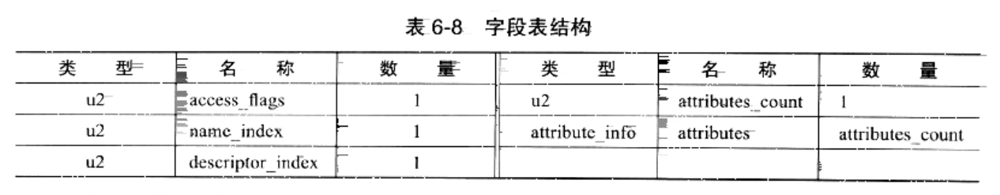
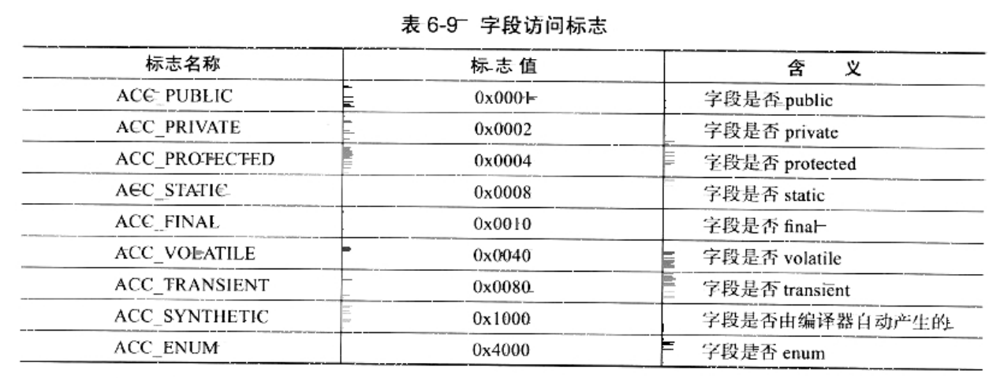
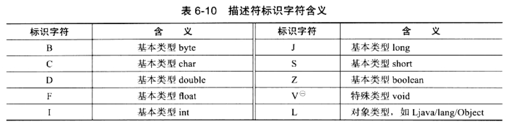

### 字段表集合

> 字段表(field_info)跟在接口表集合之后，第一个u2类型数据为容量计数器fields_count

字段表用于描述接口或者类中声明的变量

* 字段(field)包括：类级变量、以及实例级变量，但不包括在方法内部声明的局部变量。
* 想一想Java中描述一个字段可以包含的信息：
    1. 字段的作用域(public、private、protected)，3选一
    2. 是实例变量还是类变量(static)
    3. 不可同时存在
        1. 可变性(final)
        2. 并发可见性(volatile，是否强制从主内存读写)
    4. 可否被序列化(transient)
    5. 字段数据类型(基本类型、对象、数组)
    6. 字段名称
* 上述这些信息中，每个修饰符都是boolean值，要么有某个修饰符、要么没有，很适合用标志位来表示
* 字段叫什么名字、字段被定义为什么数据类型，这些是无法固定的，只能引用常量池中的常量来描述

##### 字段表结构



1. access_flags：访问标志
2. 对常量池的引用
    1. name_index：名称索引，字段的简单名称
    2. descriptor_index：描述符索引，字段和方法的描述
    3. 字段表都包含的固定数据项目，到descriptor_index为止就结束了
    4. 跟在后面的[属性表集合(attribute_info)](CFS_AttributeList.md)：用于存储一些额外的信息
        * 字段都可以在属性表中描述0至多项的额外信息
        * 示例：
        ```
        对于：private int m，它的属性表计数器为0，也就是没有额外描述的信息。
        但如果改为：final static in m = 123，那就可能会存在一项名为ConstantValue的属性，值指向常量123
        ```



##### 简单名称、全限定名：

1. 全限定名：org/xxx/xxx/TestClass，这个是类的全限定名，仅仅是把全类名的"."替换为"/"。为使多个全限定名之间不产生混淆，使用";"分隔
2. 简单名称：没有类型和参数修饰的方法或者字段名称：inc()方法和m字段的简单名称分别是"inc"和"m"

##### 描述符

> 相比简单名称、全限定名，描述符要复杂不少

描述符的作用是：描述字段的数据类型、方法的参数列表(数量、类型、顺序)和返回值。
1. 根据描述符规则：基本数据类型、代表无返回值的void类型都用一个大写字符来表示
    ```
    void类型在虚拟机规范中单独列出为"VoidDescriptor"，为统一结构，将其列在基本数据类型中一起描述
    ```
2. 对象类型则用字符L加对象的全限定名来表示

    
3. 对于数组类型：每一维度将使用一个前置的"["字符描述
    ```
    例如：
    1. 一个定义为"java.lang.String[][]"类型的二维数组，将被记录为："[[Ljava/lang/String;"
    2. 一个整形数组"int[]"将被记录为"[I"
    ```
4. 描述方法时：
    * 按照：先参数列表，后返回值的顺序进行描述
    * 将翻书列表按照参数的严格顺序，放在一组小括号"()"之内
    * 示例：
        1. void inc()的描述符为："()V"
        2. java.lang.String toString()的描述符为："()Ljava/lang/String;"
        3. int indexOf(char[] source, int sourceOffset, int sourceCount, char[] target, int targetOffset, int targetCount, int fromIndex)：
            * 描述符为："([CII[CIII)I"

##### 其他

* 字段表集合中不会列出从超类、或者父接口中继承而来的字段
* 但有可能列出原本Java代码之中不存在的字段
    * 譬如：在内部类中，为了保持对外部类的访问性，会自动添加指向外部类实例的字段
* 另：在Java语言中，字段是无法重载的。
    * 两个字段的数据类型、修饰符，不管是否相投，都必须使用不一样的名称
    * 但是对于字节码来讲，如果两个字段的描述符不一致，那字段重名就是合法的