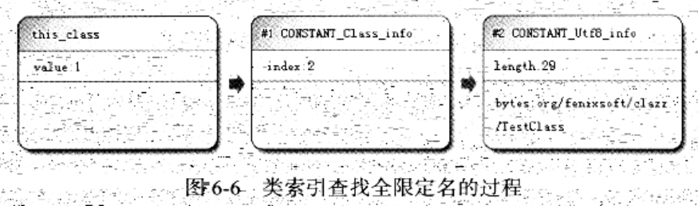

### 类索引、父类索引、接口索引集合

> 类索引、父类索引和接口索引集合都按照顺序排列在访问标志之后。

* 类索引(this_class)和父类索引(super_class)都是一个u2类型的数据
    1. 类索引用于确定这个类的全限定名
    2. 父类索引用于确定这个类的父类的全限定名
    3. Java语言不允许多重继承，所以父类索引只有一个
        1. 除了java.lang.Object之外，所有的Java类都有父类
        2. 因此除了java.lang.Object外，所有Java类的父类索引都不为0
    4. 类索引/父类索引，各自指向一个类型为<CONSTANT_Class_info>的类描述符常量
        * 通过CONSTANT_Class_info类型常量中的索引值，可以找到定义在CONSTANT_Utf8_info类型常量中的全限定名字符串

        
* 接口索引集合(interfaces)是一组u2类型的数据的集合
    * 接口索引用来描述这个类实现了那些接口
        * 这些被实现的接口将按implements语句(如果这个类本身是一个接口，则应当是extends语句)后的接口顺序，从左到右排列在接口索引集合中
    * 接口索引集合的入口第一项——u2类型的数据是接口计数器(interfaces_count)
        * 表示接口索引表的容量
        * 如果该类没有实现任何接口，则该计数器值为0。后面的接口索引表也不再占用任何字节。

* Class文件中由以上三项数据来确定这个类的继承关系

