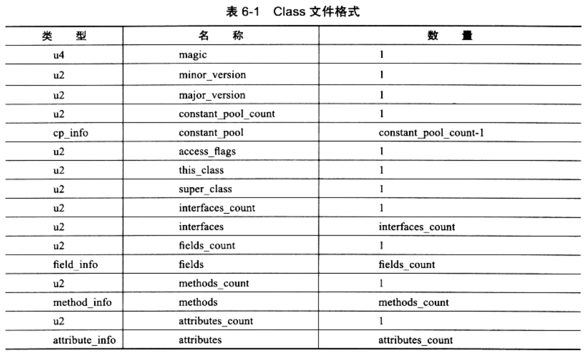

### 类文件结构简介

```
任何一个Class文件都对应着唯一一个类或接口的定义信息，
但反过来说，类或接口并不一定都得定义在文件里(譬如类或接口也可以通过类加载器直接生成)
我们通俗地将任意一个有效地类或接口所应当满足的格式称为"Class文件格式"
实际上它并不一定以磁盘文件的形式存在
```


Class文件简述：
* Class文件是一组以8位字节为基础单位的二进制流，各个数据项目严格按照顺序紧凑地排列在Class文件中
* 中间没有添加任何分隔符，这使得整个Class文件中存储的内容，几乎全都是程序运行的必要数据，没有空隙存在
* 当遇到需要 占用8个字节以上空间的数据项时，则会按照<高位在前>的方式分隔成若干个8为字节进行存储
    * 高位在前(Big-Endian)具体指：<最高位字节在地址最低位、最低位字节在地址最高位>的顺序来存储数据
    * SPARC、PowerPc等处理器默认采用高位在前。而x86等处理器则使用相反的<Little Endian>顺序存储数据

根据JVM规范规定：
* Class文件格式采用一种类似<C语言结构体>的伪结构来存储数据
* 这种伪结构中只有两种数据类型：
    1. 无符号数
        * 无符号数术语基本的数据类型
        * 以u1、u2、u4、u8来分别代表1/2/4/8个字节的无符号数
        * 无符号数可以用来描述：数字、索引引用、数量值、按照UTF-8编码构成的字符串值
    2. 表
        * 表示由多个无符号数或其他表作为数据项构成的复合数据类型
        * 所有表都习惯性地以"_info"结尾
        * 表用于描述有层次关系的复合结构的数据
        * 整个Class文件本质上就是一张表，由如下数据项构成：

        

```
无论是无符号数、还是表，当需要描述同一类型但数量不定的锁哥数据时，
经常会使用一个前置的<容量计数器>加若干个连续地数据项的格式，
这是，称这一系列连续地某一类型的数据项，为某一类型的集合
```

##### Class文件的结构不想XML等描述语言

它没有任何分隔符号
* 所以在上表中的数据项，无论是顺序还是数量
* 甚至于数据存储的字节序(Byte Ordering，Class文件中的字节序为Big-Endian)这种细节
* 都是被严格限定的
* 哪个字节代表什么含义、长度是多少、先后顺序如何，都不允许改变。

##### 接下来用的示例代码

```
public class TestClass{
    private int m;

    public int inc(){
        return m + 1;
    }
}
```
