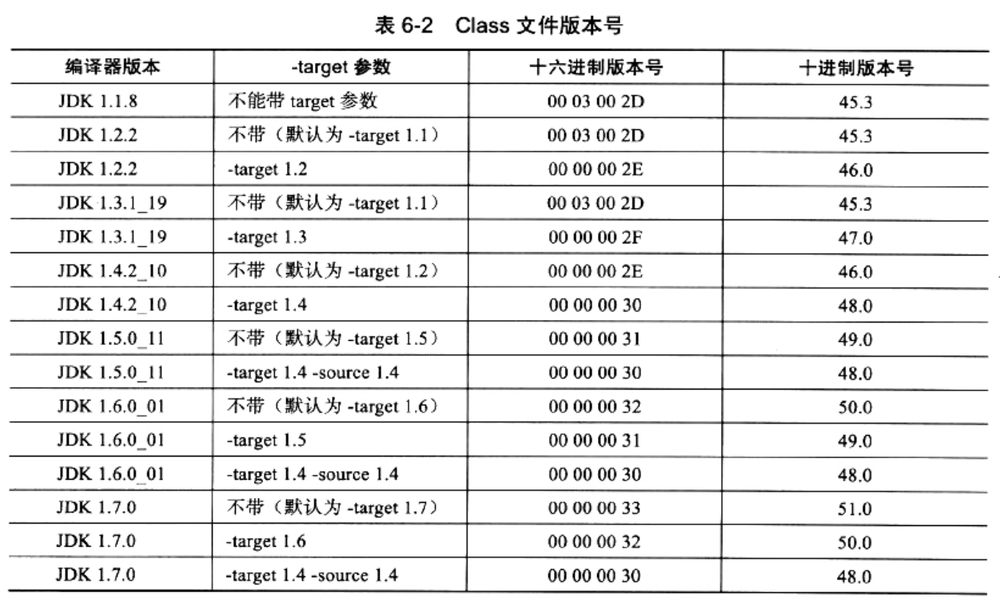

### 魔数与Class文件的版本

##### 魔数值

* 每个Class文件的头4个字节，称为魔数(Magic Number)
    * 它的唯一作用是：确定这个文件是否为一个能被虚拟机接收的Class文件
    * 很多文件存储标准中，都是用魔数来进行身份识别，比如图片格式：gif或jpeg等在文件头中就存有魔数
* 使用魔数而不是扩展名来进行识别，主要是：基于安全方面的考虑，因为扩展名可以随意改动
* 文件格式的制定者可以自由地选择魔数值，只要这个魔数值还没有被广泛采用过、同时又不会引起混淆即可。
* Class文件的魔数值在Java还称作"Oak"语言时就确定下来了：0xCAFEBABE。很浪漫。

##### 版本号

* 紧接着魔数的4个字节，存储的是Class文件的版本号：
    1. 5/6字节是次版本号(Minor Version)
    2. 7/8字节是主版本号(Major Version)
* Java的版本号从45开始，JDK1.1之后的每个JDK大版本发布，主版本号向上加1(JDK1.0~1.1使用了45.0~45.3)
* 高版本的JDK能向下兼容以前版本的Class文件，但不能运行以后版本的Class文件
* 即使文件格式并未发生任何变化，虚拟机也必须拒绝执行超过其版本号的Class文件

