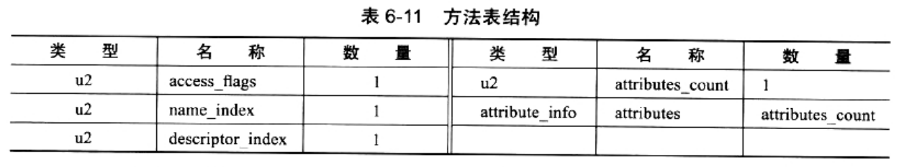
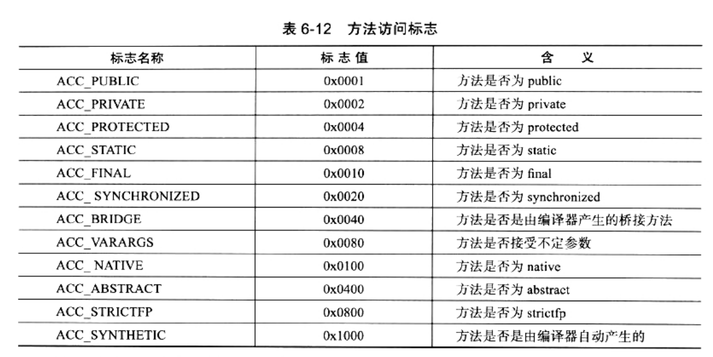

### 方法表集合

> 方法表集合紧跟字段表集合，第一个u2类型的数据也是计数器(methods_count)

Class文件存储格式中，对方法的描述与对字段的描述，几乎采用了完全一致的方式

* 由于volatile和transient关键字不能修饰方法
* 相对synchronized、native、strictfp和abstract关键字合一修饰方法
    1. strictfp(strict float point，精确浮点)，可应用于类、接口或方法，但是不允许对接口中的方法以及构造函数声明strictfp关键字
    2. 使用此关键字声明一个方法，该方法中所有float/double表达式，都严格遵守FP-strict的限制，复核IEEE-754规范
    3. 对类/接口使用此关键字：该类中的所有代码(包括嵌套类中的初始设定值和代码，都将严格地进行计算)
    4. 如果想让浮点运算更加精确，并且不会因为不同硬件平台产生执行结果不同的话，考虑使用此关键字
* 方法表的访问标志如下：

* 方法的定义可以通过访问标志、名称索引、描述索引表达清楚，但方法体中的代码去哪儿了？
* 方法里的Java代码，经过编译器编译成字节码指令后，存放在方法属性表集合中一个名为"Code"的属性里。

##### 其他

* 如果父类方法在子类中没有被重写(Override)，方法表集合中就不会出现来自父类的方法信息
* 但有可能会出现由编译器自动添加的方法，最典型的：类构造器"<clinit>"方法和实例构造器"<init>"方法
* Java语言中，要重载(Overload)一个方法：
    1. 除了要与原方法具有相同的简单名称之外
    2. 还要求必须拥有一个与原方法不同的特征签名
        1. Java代码的方法特征签名只包括：方法名称、参数顺序、参数类型
        2. 字节码的特征签名还包括：方法返回值、受查异常表
    3. 特征签名是：
        1. 一个方法中，各个参数在常量池中的字段符号的引用集合
        2. 也就是：因为返回值不会包含在特征签名轴
        3. 因此，Java语言是无法仅仅依靠返回值的不同来对一个已有方法进行重载的
    4. 但在Class文件格式中，特征签名的范围更大一些
        * 只要描述不是万千一直的两个方法，也可以共存
    5. 也就是说：如果两个方法有相同的名称和特征签名，但返回值不同，那么也可以合法共存于同一个Class文件中