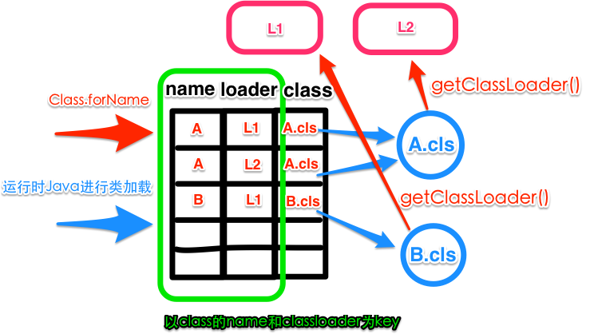

### ClassLoader

##### JVM如何判断两个类相同
>在JVM中，如何确定一个类型示例(Class instance)？
```
对于任意一个类，都需要由加载它的加载器和这个类本身，同一确定其在JVM虚拟机中的唯一性。
每一个类加载器，都有一个独立的类名称空间。
换句话说：
    比较两个类是否“相等”，只有在两个类是由同一个类加载器加载的前提下才有意义。
    否则，即使这两个类来源于同一个Class文件，被同一个虚拟机加载，只要加载它们的类加载器不同，则这两个类必定不“相等”
此处“相等”，包括类的Class对象的equals()方法、isAssignableFrom()方法、isInstance()方法、instanceOf关键字的判断等情况。
```

> 在JVM中，类型被定义在一个叫SystemDictionary 的数据结构中，该数据结构接受类加载器和全类名作为参数，返回类型实例。



> 类型加载时，需要传入类加载器和需要加载的全类名，如果在 SystemDictionary 中能够命中一条记录，则返回class 列上对应的类型实例引用，如果无法命中记录，则会调用loader.loadClass(name);进行类型加载。

##### JVM中ClassLoader的结构
JVM中，只存在两种不同的类加载器：
* 启动类加载器(Bootstrap ClassLoader)：此加载器使用C++实现，是虚拟机自身的一部分
* 所有其他的类加载器：使用Java语言实现，独立于虚拟机外部，并且全部继承自java.lang.ClassLoader


对Java开发人员来说，类加载器可以划分得更细致一些：
1. 启动类加载器(Bootstrap ClassLoader)
    1. 负责将存放在<JAVA_HOME>\lib目录中、被-Xbootclasspath参数指定路径中的，并是虚拟机识别的(仅按文件名识别，如rt.jar，名字不符合的即使在路径下也不会加载)类库加载到虚拟机内存中。
    2. 启动类加载器无法被JAVA程序直接引用
2. 扩展类加载器(Extension ClassLoader)
    1. 这个类加载器由sun.misc.Launcher$ExtClassLoader实现，负责加载<JAVA_HOME>\lib\ext目录中的、或被java.ext.dirs系统变量指定路径中的所有类库。
    2. 开发者可以直接使用扩展类加载器
3. 应用程序类加载器(Application ClassLoader)
    1. 这个类加载器由sun.misc.Launcher$AppClassLoader实现。
    2. ClassLoader中getSystemClassLoader()的返回值就是它，所以也成为系统类加载器
    3. 负责加载用户类路径(Class)上指定的类库
    4. 开发者可以直接使用这个类加载器
    5. 如果应用程序中没有自定义过自己的类加载器，一般情况它就是默认的类加载器

##### ClassLoader的关系
1. 通过观察sun.misc.Launcher源码，得知：AppClassLoader的parent是ExtClassLoader；ExtClassLoader的parent是null，但实际上是BootstrapClassLoader。
2. 测试可知：int.class(基本类型).getClassLoader()为null，通过BootstrapClassLoader加载。

##### 双亲委托(ParentsDelegation)
类加载器之间的层次关系称为：双亲委托模型。

双亲委托模型要求：除了顶层的启动类加载器外，其余的类加载器都应该有自己的父类加载器。

类加载器之间的父子关系，不会以继承的模式实现，通常都是组合的关系来实现。

```
双亲委托的工作过程是：
如果一个类加载器收到了类加载的请求，它受限不会自己尝试加载，而是把请求委托给父类加载器去完成，每一个层次的类加载器都是如此。
因此所有的加载请求，最终都应该传送到顶层的启动类加载器中。
只有当父类加载器反馈自己无法完成这个加载请求时，子类加载器才会尝试自己去加载。
```

```
使用双亲委托模型来组织类加载器之间的关系，有一个显而易见的好处是：Java类随着他的类加载器一起具备了一种带有优先级的层次关系。
例如类java.lang.Object，它存放在rt.jar中，无论哪一个类加载器尝试加载这个类，都是委托给最顶端的启动类加载器进行加载，Object类就再各种环境中都是同一个类。
```

##### 破坏双亲委托
目前为止，双亲委托模型主要出现过3次较大规模的"被破坏"
1. 第一次出现在，双亲委托迫性出现之前(JDK1.2之前)。双亲委托在1.2引入，但ClassLoader在1.0就存在。为了向前兼容，添加了一个protected的findClass方法。
2. 模型自身缺陷导致了第二次“被破坏”。双亲委托解决了各个类加载器的基础类统一问题。但如果基础类需要回调用户的代码，则无法实现。
    1. JNDI服务有启动类加载器去加载，但JNDI需要调用独立厂商实现、并部署在应用程序ClassPath下的JNDI接口提供者的代码。此时启动类加载器无法识别这些代码。
    2. 线程Context类加载器负责解决这个问题。通过java.lang.Thread.setContextClassLoader()方法设置这个类加载器。没有设置过，则使用AppClassLoader。
    3. 所有涉及SPI的加载动作都采用这种方式：JNDI、JDBC、JCE、JAXB和JBI
3. 第三次出现，由于用户对程序动态性的追求。代码热替换、模块热部署，类似即插即用。

##### ClassLoader重要方法
* loadClass =>  protected Class<?> loadClass(String name, boolean resolve) throws ClassNotFountException
    1. 执行findLoadedClass(String)去检测这个class是不是已经加载过了。
    2. 执行父加载器的loadClass方法。如果父加载器为null，则jvm内置的加载器去替代，也就是Bootstrap ClassLoader。这也解释了ExtClassLoader的parent为null,但仍然说Bootstrap ClassLoader是它的父加载器。
    3. 如果向上委托父加载器没有加载成功，则通过findClass(String)查找。
> 需要自定义ClassLoader时，最好只覆盖findClass()方法，来处理parentClassLoader没有加载到的类。

* defineClass
    1. defineClass方法接受一组字节，然后将其具体化为一个Class类型实例
    2. 它一般从磁盘上加载一个文件，然后将文件的字节传递给JVM
    3. 通过JVM（native 方法）对于Class的定义，将其具体化，实例化为一个Class类型实例。
##### 参考

[深入浅出ClassLoader, 你真的了解ClassLoader吗？](http://ifeve.com/classloader/)

[一看你就懂，超详细java中的ClassLoader详解](http://blog.csdn.net/briblue/article/details/54973413)

[深入分析Java ClassLoader原理](http://blog.csdn.net/xyang81/article/details/7292380)

[类加载器CLASSLOADER的工作机制](https://zhuanlan.zhihu.com/p/20524252)