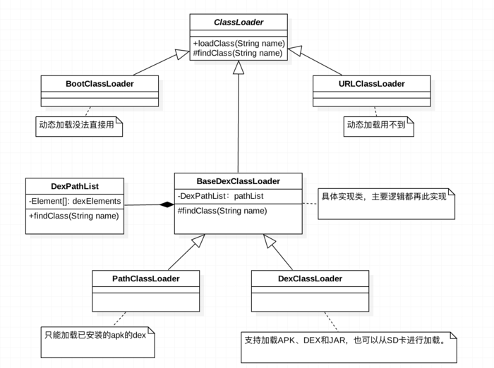

### 安卓ClassLoader

##### Android中ClassLoader的结构

* BootClassLoader
    1. Android系统启动时会使用BootClassLoader来预加载常用类
* PathClassLoader
    1. PathClassLoader是用来加载Android系统类和应用的类，并且不建议开发者使用。
    2. 加载非系统应用程序类，则会加载data/data/app/目录下的dex相关文件
    3. systemClassLoader就是它，parent是BootClassLoader
    4. PathClassLoader只能加载dalvik虚拟机上已安装的apk的dex
    5. PathClassLoader可以加载art虚拟机上未安装的apk的dex（在art平台上已验证）
        > 然而在/data/dalvik-cache 确未找到相应的dex文件，怀疑是art虚拟机判断apk未安装，所以只是将apk优化后的odex放在内存中，之后进行释放，这只是个猜想，希望有知道的可以告知一下。
* [DexClassLoader](../../../../Production/Android/Tricks/MultiDex/DexClassLoader.md)
    1. DexClassLoader可以加载dex文件以及包含dex的apk文件或jar文件，也支持从SD卡进行加载
    2. 在BaseDexClassLoader里对".jar",".zip",".apk",".dex"后缀的文件最后都会生成一个对应的dex文件,所以最终处理的还是dex文件,而URLClassLoader并没有做类似的处理。
    3. 它是热修复和插件化技术的基础

##### BootClassLoader的创建
1. ZygoteInit.java -> main() -> preLoad(traceLog) -> preloadClasses()
2. 通过PRELOADED_CLASSES路径 -> 获取需要PreLoad的类的字符串line -> Class.forName(line,true,loader : null)
3. Class.forName()中，if(loader == null) loader = BootClassLoader.getInstance()
4. 至此BootClassLoader创建完毕

##### PathClassLoader的创建
1. ZygoteInit.java -> main() -> startSystemServer() -> handleSystemServerProcess() -> createPathClassLoader()
2. PathClassLoaderFactory.createClassLoader(...)
3. 至此PathClassLoader创建完毕


##### BaseDexClassLoader
构造器：
```
    public BaseDexClassLoader(String dexPath , File optimizedDirectory,
        String libraryPath, ClassLoader parent){
        super(parent);
        this.originalPath = dexPath;
        this.pathList = new DexPathList(this, dexPath, libraryPath, optimizedDirectory);
    }
```

构造函数包含四个参数，分别为：
1. dexPath：指目标类所在的APK或jar文件的路径,类装载器将从该路径中寻找指定的目标类,该类必须是APK或jar的全路径.如果要包含多个路径,路径之间必须使用特定的分割符分隔,特定的分割符可以使用System.getProperty(“path.separtor”)获得。上面"支持加载APK、DEX和JAR，也可以从SD卡进行加载"指的就是这个路径，最终做的是将dexPath路径上的文件ODEX优化到内部位置optimizedDirectory，然后，再进行加载的。
2. File optimizedDirectory：由于dex文件被包含在APK或者Jar文件中,因此在装载目标类之前需要先从APK或Jar文件中解压出dex文件,该参数就是制定解压出的dex 文件存放的路径。这也是对apk中dex根据平台进行ODEX优化的过程。其实APK是一个程序压缩包，里面包含dex文件，ODEX优化就是把包里面的执行程序提取出来，就变成ODEX文件，因为你提取出来了，系统第一次启动的时候就不用去解压程序压缩包的程序，少了一个解压的过程。这样的话系统启动就加快了。为什么说是第一次呢？是因为DEX版本的也只有第一次会解压执行程序到 /data/dalvik-cache（针对PathClassLoader）或者optimizedDirectory(针对DexClassLoader）目录，之后也是直接读取目录下的的dex文件，所以第二次启动就和正常的差不多了。当然这只是简单的理解，实际生成的ODEX还有一定的优化作用。ClassLoader只能加载内部存储路径中的dex文件，所以这个路径必须为内部路径。
3. libPath：指目标类中所使用的C/C++库存放的路径
4. classloader：是指该装载器的父装载器,一般为当前执行类的装载器，例如在Android中以context.getClassLoader()作为父装载器。

##### BaseDexClassLoader加载Class过程
1. BaseDexClassLoader中有个pathList(DexPathList类型)对象
2. pathList中包含一个DexFile的数组dexElements
3. dexPath传入的原始dex(.apk,.zip,.jar等)文件在optimizedDirectory文件夹中生成相应的优化后的odex文件
4. dexElements数组就是这些odex文件的集合
5. 如果不分包一般这个数组只有一个Element元素，也就只有一个DexFile文件
6. 对于类加载呢，就是遍历这个集合，通过DexFile去寻找。最终调用native方法的defineClass。

##### 其他关键类

* DexPathList

##### 参考

[Android动态加载基础 ClassLoader工作机制](https://segmentfault.com/a/1190000004062880)

[Android动态加载入门 简单加载模式](https://segmentfault.com/a/1190000004062952)

[Android动态加载之ClassLoader详解](https://www.jianshu.com/p/a620e368389a)

[Android解析ClassLoader（二）Android中的ClassLoader](http://blog.csdn.net/itachi85/article/details/78276837)

[Android类装载机制(DexPathList inside)](https://juejin.im/post/5abc546a6fb9a028c675c691)
