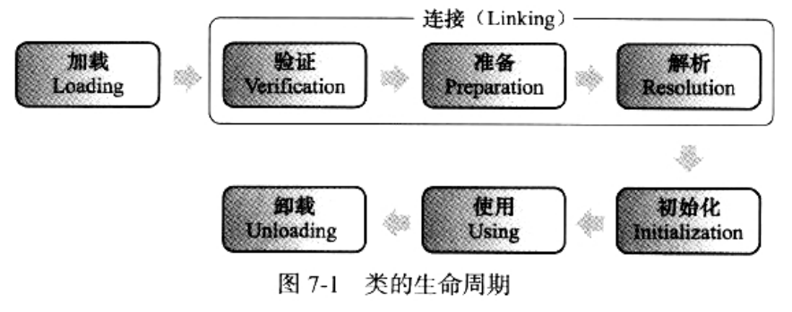

### 类加载时机

类的生命周期：
* 类从被加载到虚拟机内存中开始，直到卸载出内存为止，它的整个生命周期包括：
    1. 加载(Loading)
    2. 验证(Verification)
    3. 准备(Preparation)
    4. 解析(Resolution)
    5. 初始化(Initialization)
    6. 使用(Using)
    7. 卸载(Unloading)
* 其中，验证、准备、解析3个部分统称为：连接(Linking)
* 这7个阶段的发生顺序，如下图

    
* 上图中，加载、验证、准备、初始化和卸载，这5歌 阶段的顺序是确定的
    * 类的加载过程，必须按照这种顺序，按部就班地开始
* 而解析阶段则不一定：
    1. 它在某些情况下，可以在初始化阶段之后再开始
    2. 这是为了支持Java语言的运行时绑定(也称：动态绑定/晚期绑定)
* 注：此处只是按部就班地"开始"，而不是按部就班地"进行"或"完成"
    * 因为：这些阶段通常都是相互交叉地混合式进行的
    * 通常会在一个阶段执行的过程中，调用、激活另外一个阶段

##### 何时触发类加载
```
什么情况下需要开始类加载过程的第一个阶段"加载"？
Java虚拟机规范中，并没有进行强制约束，这点可交给虚拟机的具体实现来自由把握
```

但对于"初始化阶段"，虚拟机规范则是严格规定了：
```
有且只有5种情况，必须立即对类进行<初始化>(而加载、验证、准备，自然需要在此之前开始)：
```
1. 遇到new、getstatic，putstatic，invokestatic这4条字节码指令时
    * 如果类没有进行过初始化，则需要先触发其初始化
    * 生成这4条指令的最常见Java代码场景是：
        1. 使用new关键字实例化对象的时候
        2. 读取或设置一个类的静态字段(被final修饰、已在编译期把结果放出常量池的静态字段除外)的时候
        3. 调用一个类的静态方法的时候
2. 使用java.lang.reflect包的方法，对类进行反射调用的时候
    * 如果类没有进行过初始化，则需要先触发其初始化
3. 当初始化一个类的时候，如果发现其父类还没有进行过初始化，则需要先触发其父类的初始化
4. 当虚拟机启动时，用户需要制定一个要执行的主类(包含main()方法的那个类)，虚拟机会先初始化这个主类
5. 当使用JDK1.7的动态语言支持时
    * 如果一个java.lang.invoke.MethodHandler实例，最后的解析结果是：
        * REF_getStatic、REF_putStatic、REF_invokeStatic的方法句柄
        * 并且这个方法句柄所对应的类没有进行过初始化
        * 则需要先出发其初始化

```
上述5种会触发类初始化的场景，虚拟机规范中使用了一个很强烈的现定于：有且只有
这5种场景中的行为成为对一个类进行"主动引用"。
除此之外，所有引用类的方式，都不会触发初始化，称为"被动引用"
```
被动引用举例：
1. 通过子类，引用父类的静态字段，不会导致子类初始化：[示例代码](../../../../TutorialCodeSample/src/main/java/com/xcstasy/tutorial/jvm/classloading/NotInitAccessingStaticInSuperClass.java)
    * 对于静态字段：只有直接定义这个字段的类才会被初始化
    * 因此：通过其子类来引用父类中定义的静态字段，只会触发父类的初始化，而不会触发子类的初始化
    * 至于是否要触发子类的加载和验证，VM规范中并未明确规定，取决于虚拟机的具体实现
    * 对于Sun HotSpot虚拟机，可以通过-XX:+TraceClassLoading观察到：此操作会导致子类的加载
2. 通过数组定义来引用类，不会触发此类的初始化：[示例代码](../../../../TutorialCodeSample/src/main/java/com/xcstasy/tutorial/jvm/classloading/NotInitDefiningArray.java)
    * 对于SuperClass类，此示例代码没有输出"SuperClass init"，说明：没有触发此类的初始化阶段
    * 但这段代码里，出发了另一个名为"[Lxxx.xxx.xxxSuperClass"类的初始化("["代表数组，"L"代表对象，这里初始化了一个数组对象)
        * 对于用户代码来说，这并不是一个合法的类名，它是一个由虚拟机自动生成、直接继承与java.lang.Object的子类
        * 创建动作由字节码指令newarray触发
    * 这个类，代表了一个元素类型为SuperClass的一维数组，数组中应有的属性和方法(用户可以直接使用的只有被修饰为public的length属性和clone()方法)都实现在这个类里
    * Java中，对数组的访问比C/C++相对安全，是因为：这个类封装了数组元素的访问方法
        1. 准确的说，越界检查不是封装在数组元素访问的类中，而是封装在数组访问的xaload、xastore字节码指令中
        2. 检查到数组越界时，会抛出ArrayIndexOutOfBoundsException异常
3. 常量在编译阶段会存入调用类的常量池中，本质上并没有直接引用到定义常量的类，引用常量不会触发定义常量的类的初始化：[示例代码](../../../../TutorialCodeSample/src/main/java/com/xcstasy/tutorial/jvm/classloading/NotInitConstantValue.java)
    * 编译阶段，通过常量传播优化，已经将常量的值"hello world"，存储到该类的常量池中
    * 之后所有对该常量的引用，都变成对该类常量池的引用。
    * 也就是说：测试类中，并没有ConstClass类的符号引用入口，这两个类在编译成Class之后就不存在任何联系了。
    * 详见[虚拟机类文件结构-属性表-ConstantValue属性](../ClassFileStructure/CFS_AttributeList.md)

##### 接口的初始化

> 接口的加载过程与类加载过程，稍有些不同

* 接口也有初始化过程，这点与类是一致的
* 之前提到的类初始化，都是用静态代码块"static{...}"来输出初始化信息
* 而接口中不能使用"static{...}"代码块
* 但编译器仍然会为接口生成"<_clinit>()"类构造器，用于初始化接口中所定义的成员变量
* 接口与类真正有所区别的是：上文提及的5种"有且仅有"需要开始初始化的第3种：
    * 当一个类在初始化时，要求其父类全部都已经初始化过了
    * 但一个接口在初始化时，并不要求其父接口全部完成初始化
    * 只有在真正使用到父接口时(如引用接口中定义的常量)才会初始化