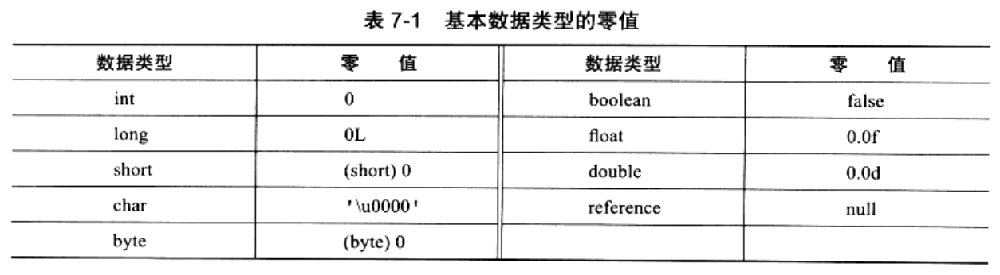

### 准备

* 准备阶段是正式为类变量分配内存、并设置类变量初始值的阶段
* 这些变量所使用的内存，都将在方法区中进行分配
* 这个阶段中有两个容易产生混淆的概念要强调：
    1. 这时候进行内存分配的仅包括<类变量>(static修饰的)，不包括<实例变量>
        * 实例变量将会在对象实例化时，随着对象一起分配到Java堆中
    2. 这里所说的初始值，"通常情况"下，是数据类型的零值
        * 假设一个类变量的定义为：public static int value = 123
        * 那变量value在准备阶段过后的初始值是0，而不是123
        * 因为这时候尚未开始执行任何Java方法
        * 而把value赋值为123的putstatic指令是程序被编译后，存放于类构造器<_clinit>()方法中
        * 所以把value赋值为123的动作在初始化阶段才会执行

        

* 上面提到：在"通常情况"下初始值是零值，相对会有些"特殊情况"：
    1. 如果类字段的字段属性表中，存在ConstantValue属性
        * 那在准备阶段，变量value就会被初始化为ConstantValue属性所指定的值
        * 假设value定义为：public static final int value = 123;
        * 编译时，Javac将会为value生成ConstantValue属性
        * 在准备阶段，虚拟机就会根据ConstantValue的设置，将value赋值为123.
