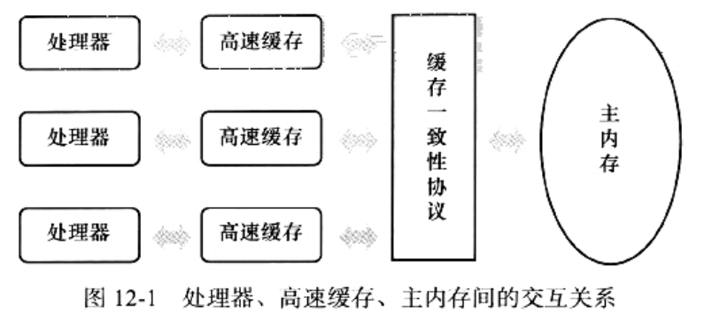

### 硬件效率与一致性

先让我们花些时间去了解一下"物理计算机中的并发问题"：
```
物理机遇到的并发问题，与虚拟机中的情况有不少相似之处，
物理机对并发的处理方案，对于虚拟机的实现，也有很高的参考价值。
```
CPU与内存的I/O交互：
```
"让计算机并发执行若干个运算任务"和"更充分地利用计算机处理器的效能"，
两者之间的因果关系，看起来顺理成章，但实际上并没有想象中简单。
其中一个重要的复杂性来源是：绝大多数的运算任务，都不可能只靠处理器"计算"就能完成。
处理器至少要与内存交互，如：读取运算数据、存储运算结果等，这个I/O操作是很难消除的(无法紧靠寄存器来完成所有运算任务)。
```
高速缓存：
```
由于计算机的存储设备与计算机的运算速度，有几个数量级的差距，
所以：现在计算机系统都不得不加入一层"读写速度尽可能接近处理器运算速度的高速缓存(Cache)"，
来作为内存与处理器之间的缓冲：将运算需要使用到的数据复制到缓冲中，让运算能快速进行，
当运算结束后，再从缓存同步回内存之中，这样处理器就无需等待换班的内存读写了。
```

##### 缓存一致性(Cache Coherence)

```
基于告诉缓存的存储交互很好地解决了处理器与内存的速度矛盾，
但也为计算机系统带来更高的复杂度，因为它引入了一个新的问题：缓存一致性
```



* 在多处理器系统中，每个处理器都有自己的告诉缓存，而它们又共享同一主内存(Main Memory)
* 当讴歌处理器的运算任务，都涉及同一块主内存区域时：
    * 强可能导致各自的缓存数据不一致
    * 如果真的发生这种情况，那同步回到主内存时，以谁的缓存数据为准呢？
* 为了解决一致性的问题，需要各个处理器访问缓存时，都遵循一些协议：
    * 在读写时要根据协议来进行操作，这类协议有：MSI、MESI(Illinois Protocol)、MOSI、Synapse、Firefly及Dragon Protocol等

##### 内存模型
* 本章节中，多次提到的"内存模型"一词，可以理解为：
    * 在特定的操作协议下，对特定的内存或高速缓存，进行读写访问的过程抽象。
* 不同架构的物理机，可以拥有不一样的内存模型，Java虚拟机也有自己的内存模型
* 并且，这里介绍的内存访问操作，与硬件的缓存访问操作具有很高的可比性。

##### 指令重排(Instruction Reorder)
* 除了增加高速缓存之外，为了使得处理器内部的运算单元能尽量被充分利用
* 处理器可能会对输入代码进行乱序执行(Out-Of-Order Execution)优化：
    1. 处理器会在计算之后，将乱序执行的结果充足
    2. 保证该结果与顺序执行的结果时一致的
    3. 但并不保证：程序中各个语句计算的先后顺序与输入代码中的顺序一致
* 因此，如果存在：一个计算任务依赖另一个计算任务的中间结果
    * 那么，其顺序性并不能靠代码的先后顺序来保证
* 与处理器的乱序执行优化类似，Java虚拟机的即时编译器中，也有类似的指令重排序(Instruction Reorder)优化
