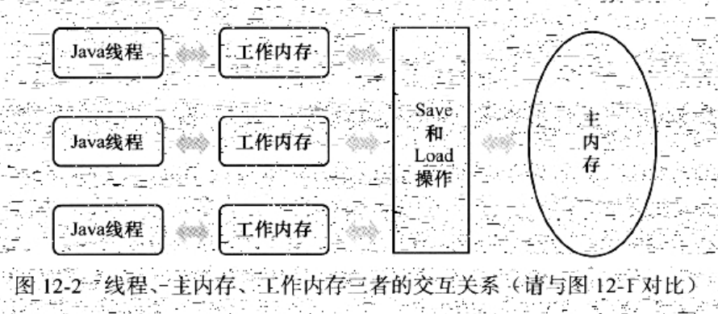

### 主内存与工作内存

Java内存模型的主要目标是：
* 定义程序中，各个变量的访问规则。
* 即：在虚拟机中，将变量存储到内存、和从内存中取出变量，这样的底层细节。
    1. 此处的变量(Variables)与Java变成中所说的变量，有所区别。
    2. 它包括了：实例字段、静态字段和构成数组对象的元素；但不包括局部变量与方法参数
    3. 因为后者是线程私有的，不会被共享，自然就不会存在竞争问题
        ```
        此处注意：如果局部变量是一个reference类型，它引用的对象在Java堆中，可以被各个线程共享。
        但是，reference本身，在Java栈的局部变量表中，它是线程私有的。
        ```
* 为了获得较好的执行效能
    1. Java内存模型并没有限<执行引擎使用处理器的特定寄存器或缓存>来和主内存进行交互
    2. 也没有限制即时编译器进行调整代码执行顺序这类优化措施。

##### 规定细节



* Java内存模型规定了：
    1. 所有变量，都存储在主内存中(Main Memory)
        ```
        此处的主内存，与介绍物理机时的主内存名字一样，两者也可以互相类比。
        但此处仅是虚拟机内存的一部分
        ```
    2. 每条线程还有自己的工作内存(WorkingMemory,可以与前面讲的<处理器高速缓存>类比)
        * 线程的工作内存中，保存了被该线程使用到的变量的主内存副本拷贝
        * 线程对变量的所有操作(读取、赋值等)，都必须在工作内存中进行
        * 不能直接读写主内存中的变量(此描述对[volatile](Volatile.md)也并不例外)
    3. 不同的线程之间，也无法直接访问对方工作内存中的变量
        * 线程间变量值的传递，均需要通过主内存来完成

##### 其他

* 这里所讲的"主内存"、"工作内存"，与[Java内存区域]()一章中的Java堆、栈、方法区等，并不是同一个层次的内存划分。
* 两者基本上是没有关系的，如果两者一定要勉强对比：
    * 那从变量、主内存、工作内存的定义来看：
        1. 主内存主要对应于Java堆中的对象实例数据部分
        2. 工作内存则对应于虚拟机栈中的部分区域
    * 从更低层次上说：
        1. 主内存直接对应于物理硬件的内存
        2. 而为了获取更好地运行速度，虚拟机(甚至是硬件系统本身的优化措施)
            * 可能会让工作内存有限存储于寄存器和高速缓存中
            * 因为：程序运行时主要访问读写的是工作内存