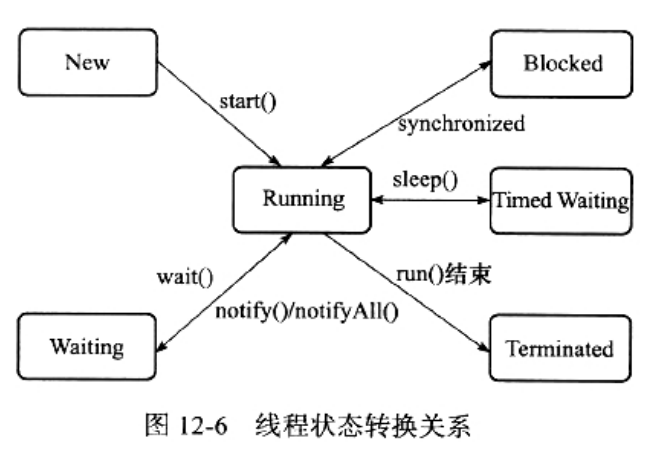

### 线程状态转换

Java语言定义了5中线程状态：
```
在任意一个时间点，一个线程只能有且只有其中的一种状态
```
1. 新建(New)：创建后，尚未启动的线程，处于这个状态
2. 运行(Runnable)：
    * Runnable包括了操作系统线程状态中的Running和Ready
    * 也就是：处于此状态的线程，可能正在执行，也可能正在等着CPU为它分配执行时间
3. 无限期等待(Waiting)：
    * 处于这种状态的线程，不会被分配CPU执行时间
    * 它们要等待被其他线程显式地唤醒
    * 一下方法会让线程进入此状态：
        1. 没有设置Timeout参数的Object.wait()方法
        2. 没有设置Timeout参数的Thread.join()方法
        3. LockSupport.park()方法
4. 限期等待(Timed Waiting)：
    * 处于这种状态的线程，也不会被CPU分配执行时间
    * 不过无需等待被其他线程显式地唤醒
    * 在一定时间后，它们会由系统自动唤醒
    * 一下方法会让线程进入此状态
        1. Thread.sleep()方法
        2. 设置了Timeout参数的Object.wait()方法
        3. 设置了Timeout参数的Thread.join()方法
        4. LockSupport.parkNanos()方法
        5. LockSupport.parkUntil()方法
5. 阻塞(Blocked)：
    * 线程被阻塞了，"阻塞状态"与"等待状态"的区别是：
        1. "阻塞状态"在等待着获取到一个排他锁，这个时间将在另外一个线程放弃这个锁的时候发生。
        2. "等待状态"则是：在等待一段时间、或者唤醒动作的发生
    * 在程序等待进入同步区域的时候，线程将进入此状态
6. 结束(Terminated)：
    * 已经终止的线程，处于此状态。线程已经结束执行。

线程状态转化关系如图：

