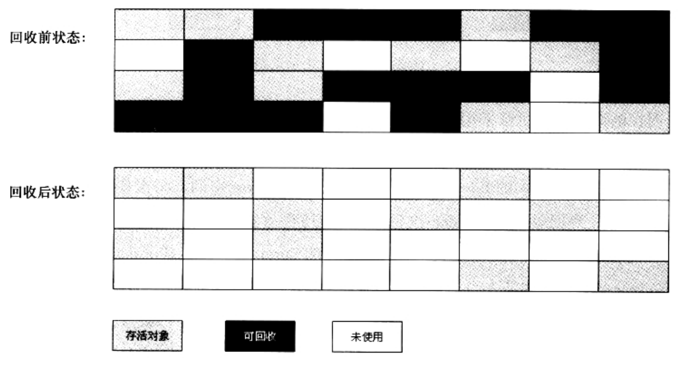
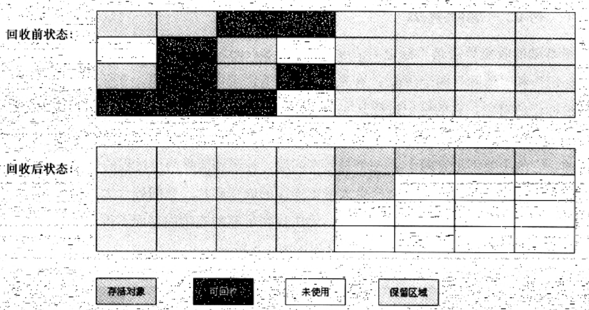

### 垃圾收集算法

##### 标记-清除算法(Mark-Sweep)

此算法分为"标记"和"清除"两个阶段：
* 首先标记出所有需要回收的对象([另见：标记过程](Finalize.md))
* 在标记完成后统一回收所有被标记的对象

> 此算法是最基础的收集算法：后续的收集算法都是基于这种思路并对其不足进行改进而得到的。

主要不足：
1. 效率问题：标记和清除两个过程的效率都不高
2. 空间问题：标记清除之后会产生大量不连续的内存碎片
    ```
    空间碎片太多可能会导致以后再程序运行过程中需要分配较大对象时，无法找到足够的连续内存，而不得不提前出发另一次GC。
    ```



##### 复制算法(Copying)

此算法为了解决效率问题：
* 它将可用内存按容量划分为大小相等的两块，每次只是用其中的一块。
* 当一块内存用完了，就将还存活的对象复制到另一块上
* 然后把已使用过的内存空间，一次性清理掉

优点：
* 每次都是对整个半区进行内存回收
* 内存分配时不用考虑内存碎片等复杂情况
* 只需要移动堆顶指针，按序分配内存即可
* 实现简单，运行高效

缺点：
* 代价明显：可用内存变为原有的一半。



实际使用：
* 现在的商业虚拟机，都采用这种算法进行对新生代的回收
* IBM公司的专门研究表明
    1. 新生代中对象98%对象是“朝生夕死”的
    2. 所以不需要按照1：1的比例来划分内存空间
    3. 而是将内存分为较大的Eden空间和两块较小的Survivor空间，每次使用Eden和其中一块Survivor
    4. 当回收时，将Eden和Survivor中还存活着的对象，一次性复制到另一块Survivor空间，最后清理掉Eden和刚用过的Survivor空间。


##### 内存的分配担保(Handle Promotion)

> HotSpot虚拟机中默认Eden和Survivor的大小比例是8：1(最初就是这种布局，跟IBM的研究没有实际联系)

* 我们有一个80%的Eden空间，还有2个10%的Survivor空间
* 每次新生代中，可用的内存空间为新生代总容量的90%(80%+10%)
* 上述"98%的对象朝生夕死"的现象并不是确定的
* 无法保证每次回收，都只有不多于10%的对象存活
* 当Survivor空间不足(如果超过了10%对象存活，则无法把存活对象都复制到某个Survivor，再清除Eden和另一个Survivor)
* 需要依赖其他内存(主要指老年代)进行分配担保。这些对象将通过分配担保机制，进入老年代。


##### 标记-整理算法(Mark-Compact)

* 赋值算法在对象存活率较高时，需要进行更多的复制操作，效率会变低
* 更关键的：
    1. 如果不想浪费50%的空间，就需要有额外的空间进行分配担保
    2. 以对应被使用的内存中，所有对象都100%存活的极端情况
    3. 所以在老年代一般不能直接选用这种算法

根据老年代的特点，衍生了标记-整理算法：
* 标记过程与标记-清除算法一样
* 但后续步骤不直接对可回收对象进行清理
* 而是让所有存活的对象都向一端移动
* 然后直接清理掉端边界意外的内存


##### 分代收集算法(Generational Collection)

> 此算法没什么新的思想，只是根据对象存活周期的不同，将内存划分为几块：

一般是把Java堆分为新生代和老年代，这样就可以根据各个年代的特点，采用最适当的收集算法：
1. 在新生代中：
    * 每次垃圾收集时，都发现有大批对象死去，只有少量存活
    * 那就选用复制算法，只需要付出少量存活对象的赋值成本，就可以完成收集
2. 在老年代中：
    * 因为对象存活率高、没有额外空间对它进行分配担保
    * 必须使用"标记-清理"或"标记-整理"算法进行回收

[内存分配与回收策略](MemoryStrategy.md)

##### 参考

[Java 技术之垃圾回收机制](http://www.importnew.com/26821.html)
