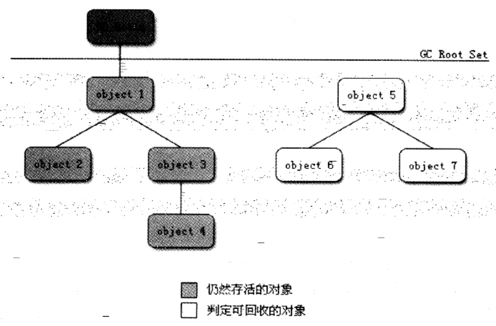

### 可达性分析算法

基本思路：
1. 通过一系列的称为"GC Roots"的对象作为起始点，从这些节点开始向下搜索
2. 搜索所走过的路径称为引用链(Reference Chain)
3. 当一个对象到GC Roots没有任何引用链相连(用图论解释：从GC Roots到这个对象不可达)时
4. 证明此对象是不可用的

如下图：右侧的3个对象相互有引用，但GC Roots不可达，所以它们被判定为可回收

##### GC Roots

Java语言中，可作为GC Roots的对象包括：
1. 虚拟机栈(栈帧中的本地变量表)中引用的对象
2. 方法区中类静态属性引用的对象
3. 方法区中常量引用的对象
4. 本地方法栈中JNI(Native方法)引用的对象

[可达性分析不一定完全判处对象的"死刑"](Finalize.md)