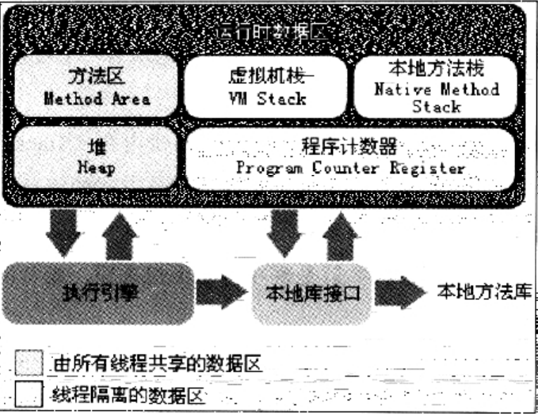

### JVM

##### 运行时数据区域

* [程序计数器](RuntimeDataArea/PC.md)
* [Java虚拟机栈](RuntimeDataArea/JvmStacks.md)
* [本地方法栈](RuntimeDataArea/NativeMethodStack.md)
* [Java堆](RuntimeDataArea/JavaHeap.md)
* [方法区](RuntimeDataArea/MethodArea.md)
* [运行时常量池](RuntimeDataArea/RuntimeConstantPool.md)
* [直接内存](RuntimeDataArea/DirectMemory.md)