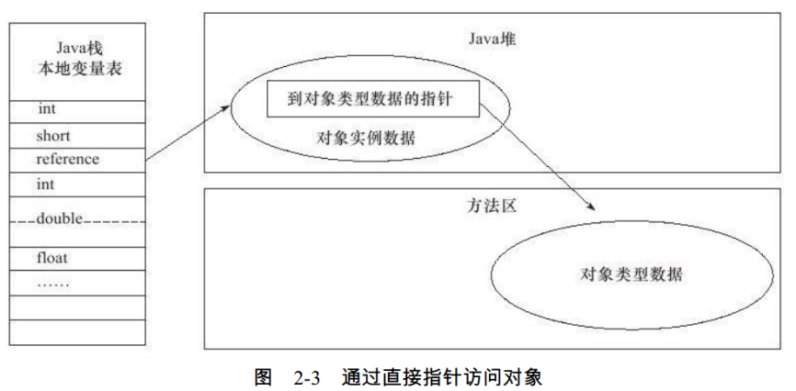

### 对象访问定位

* Java程序需要通过栈上的reference数据，来操作堆上的具体对象。
* reference类型，在Java虚拟机规范中只规定了一个指向对象的引用，并没有定义这个引用应该通过什么方式去定位、访问堆中的对象具体位置
* 所以：对象访问方式，也是取决于虚拟机实现而定。

目前主流的访问方式有两种：
1. 句柄访问：
    1. 使用句柄访问的话：则Java堆中将会划分出一块内存来作为句柄池。
    2. reference中存储的就是对象的句柄地址
    3. 句柄中包含了对象实力数据与类型数据各自的具体地址信息

2. 直接指针：
    1. 使用直接指针访问：则Java堆对象的布局中，就必须考虑如何放置访问类型数据的相关信息
    2. reference中存储的直接就是对象地址

##### 两种模式的对比

1. 句柄访问
    1. 使用句柄访问的最大好处：reference中存储的是稳定的句柄地址
    2. 对象在被移动(垃圾收集时移动对象是非常普遍的行为)时，只会改变句柄中的实力数据指针，而reference本身不需要修改
2. 直接指针
    1. 使用直接指针的最大好处：速度更快，它节省了一次指针定位的时间开销
    2. 由于对象的访问在Java中非常频繁，因此这类开销积少成多后也是一项非常可观的执行成本

对Sun HotSpot虚拟机而言，是使用直接指针方式进行对象访问的。

但从整个软件开发的范围来看，各种语言和框架使用句柄来访问的情况也十分常见。